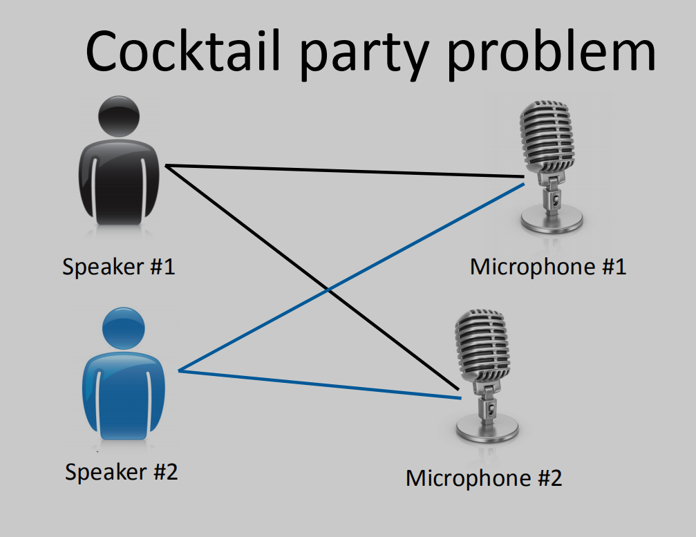
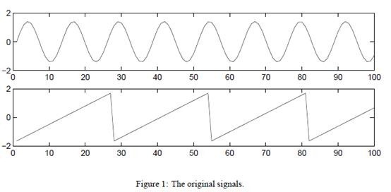
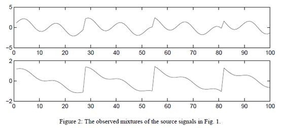
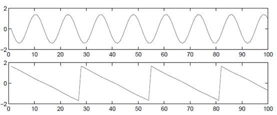
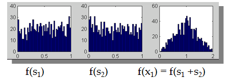
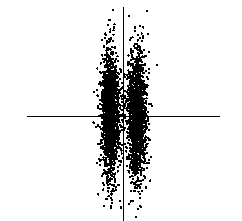
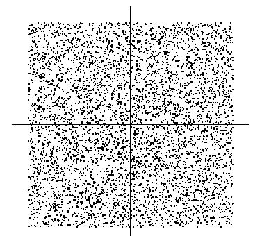
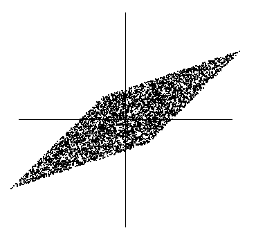
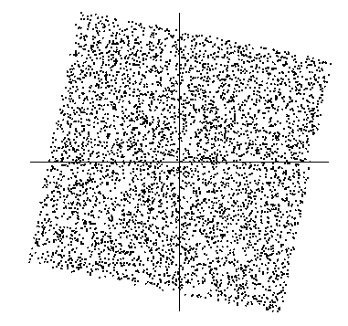

## ICA-独立成分分析(Independent Component Analysis)
鸡尾酒宴会问题是一个著名的问题,如何在混合的信息中分离出原始的信息呢?这不得不提到ICA算法.

本文是  
[JerryLead-独立成分分析(Independent Component Analysis)](https://www.cnblogs.com/jerrylead/archive/2011/04/19/2021071.html)  
[JerryLead-ICA扩展描述](https://www.cnblogs.com/jerrylead/archive/2011/04/19/2021221.html)  
的抄写版本.

如果有能力可以直接看  
[css229课程的原始讲义](../1.原始讲义/cs229-notes11.pdf)  
[《Independent Component Analysis:Algorithms and Applications》(Aapo Hyvärinen and Erkki Oja)](ica.pdf).

### 1. 问题:
1,上节提到的PCA是一种数据降维的方法,但是只对符合高斯分布的样本点比较有效,那么对于其他分布的样本,有没有主元分解的方法呢?

2,经典的鸡尾酒宴会问题(cocktail party problem).假设在party中有n个人,他们可以同时说话,我们也在房间中一些角落里共放置了n个声音接收器(Microphone)用来记录声音.宴会过后,我们从n个麦克风中得到了一组数据$x^{(i)}=[x^{(i)}_1,x^{(i)}_2,...,x^{(i)}_n]^T;i=1...m$,i表示采样的时间顺序,也就是说共得到了m组采样,每一组采样都是n维的.我们的目标是单单从这m组采样数据中分辨出每个人说话的信号.  
备注: $x^{(i)}=[x^{(i)}_1,x^{(i)}_2,...,x^{(i)}_n]^T$是n维列向量,可以表示为: $x^{(i)}=As^{(i)}$

将第二个问题细化一下,有n个信号源,第i次采样数据:$s^{(i)}=[s^{(i)}_1,s^{(i)}_2,...,s^{(i)}_n]^T;i=1...m$,每一维都是一个人的声音信号,每个人发出的声音信号独立.A是一个未知的混合矩阵(mixing matrix),用来组合叠加信号s,那么
$$
    x=As
$$
$x=[x^{(1)},x^{(2)},\cdots,x^{(m)}]$和$s=[s^{(1)},s^{(2)},\cdots,s^{(m)}]$不是向量,是矩阵.  
备注: shape(X)=(n,m),   shape(A)=(n,n),  shape(s)=(n,m)  
备注: m是采样次数,n是每次采样的数据的维数.

当n=2时的图例

$x^{(i)}$的每个分量都由$s^{(i)}$的分量线性表示.A和s都是未知的,x是已知的,我们要想办法根据x来推出s.这个过程也称作为盲信号分离.
令$W=A^{-1}$,那么$s^{(i)}=A^{-1}x^{(i)}=Wx^{(i)}$

将W表示成
$$
    W=[w_1,\cdots,w_n]^T=
    \begin{bmatrix}
        w_1^T\\
        \vdots\\
        w_n^T
    \end{bmatrix},
$$
其中$w_i\isin \mathbb{R}^n$,那么得到:$s_j^{(i)}=w_j^Tx^{(i)}$
### 2. ICA的不确定性(ICA ambiguities):
由于W和s都不确定,那么在没有先验知识的情况下,无法同时确定这两个相关参数.比如上面的公式s=Wx.当w扩大两倍时,s只需要同时扩大两倍即可,等式仍然满足,因此无法得到唯一的s.同时如果将人的编号打乱,变成另外一个顺序,如上图的蓝色节点的编号变为3,2,1,那么只需要调换A的列向量顺序即可,因此也无法单独确定s.这两种情况称为原信号不确定.

还有一种ICA不适用的情况,那就是信号不能是高斯分布的.假设只有两个人发出的声音信号符合多值正态分布,$s\sim N(0,1)$,$I$是$2\times2$的单位矩阵,s的概率密度函数就不用说了吧,以均值0为中心,投影面是椭圆的山峰状(参见[多元高斯分布](../../7.机器学习总结/多元高斯分布.md)).因为x=As,因此,x也是高斯分布的,均值为0,协方差为
$$
    E[xx^T]=E[Ass^TA^T]=AA^T.
$$
令R是正交阵$(RR^T=R^TR=I)$,$A'=AR$.如果将A替换成A'.那么$x'=A's$.s分布没变,因此x'仍然是均值为0,协方差
$$
    \begin{aligned}
        E[x'(x')^T]
        &=E[A'ss^T(A)^T]\\
        &=E[ARss^T(AR)^T]\\
        &=ARR^TA^T=AA^T.
    \end{aligned}
$$
因此,不管混合矩阵是A还是A',x的分布情况是一样的,那么就无法确定混合矩阵,也就无法确定原信号.

TODO:不懂上面的公式推导.
### 3. 密度函数和线性变换:
在讨论ICA具体算法之前,我们先来回顾一下概率和线性代数里的知识.

假设我们的随机变量s有概率密度函数$p_s(s)$(连续值是概率密度函数,离散值是概率).为了简单,我们再假设s是实数,还有一个随机变量x=As,A和x都是实数.令$p_x$是x的概率密度,那么怎么求$p_x$?

令$W=A^{-1}$,首先将式子变换成$s=Wx$,然后得到$p_x(x)=p_s(Ws)$,求解完毕.可惜这种方法是错误的.比如s符合均匀分布的话($s\sim U(0,1)$),$p_s(s)=1{0\leq s\leq1}$,现在令A=2,即x=2s,也就是说x在[0,2]上均匀分布,$p_x(x)=0.5$.然而,$p_x(x)=p_s(0.5s)=1$.正确的公式应该是

$p_x(x)=p_s(Wx)|W|$

推导方法
$$F_X(x)=P(X\leq x)=P(AS\leq x)=P(S\leq Wx)=F_S(Wx).$$
$$p_x(x)=F_X'(x)=F_S'(Wx)=p_s(Wx)|W|.$$
更一般地,如果s是向量,A可逆的方阵,那么上式子仍然成立.
### 4. ICA算法:
ICA算法归功于Bell和Sejnowski,这里使用最大似然估计来解释算法,原始的论文中使用的是一个复杂的方法Infomax principal.

我们假定每个$s_i$有概率密度$p_s$,那么给定时刻原信号的联合分布就是
$$p(s)=\prod_{i=1}^np_s(w_i^Tx)$$
这个公式代表一个假设前提:每个人发出的声音信号各自独立.有了p(s),我们可以求得p(x)
$$p(x)=p_s(Wx)|W|=|W|\prod_{i=1}^np_s(w_i^Tx).$$
左边是每个采样信号x(n维向量)的概率,右边是每个原信号概率的乘积的|W|倍.

前面提到过,如果没有先验知识,我们无法求得W和s.因此我们需要知道$p_s(s_i)$,我们打算选取一个概率密度函数赋给s,但是我们不能选取高斯分布的密度函数.在概率论里我们知道密度函数p(x)由累计分布函数(cdf)F(x)求导得到.F(x)要满足两个性质是:单调递增和在[0,1].我们发现sigmoid函数很适合,定义域负无穷到正无穷,值域0到1,缓慢递增.我们假定s的累积分布函数符合sigmoid函数$g(s)=1/(1+e^{-s})$,求导后$p_s(s)=g'(s)={e^s}/{(1+e^s)^2}$,这就是s的密度函数.这里s是实数.

如果我们预先知道s的分布函数,那就不用假设了,但是在缺失的情况下,sigmoid函数能够在大多数问题上取得不错的效果.由于上式中$p_s(s)$是个对称函数,因此E[s]=0(s的均值为0),那么E[x]=E[As]=0,x的均值也是0.

知道了$p_s(s)$,就剩下W了.给定采样后的训练样本$x^{(i)}=[x^{(i)}_1,x^{(i)}_2,...,x^{(i)}_n]^T;i=1...m$,样本对数似然估计如下:

使用前面得到的x的概率密度函数,得到对数似然函数:
$$
    \ell(W)=\sum_{i=1}^m\left(\sum_{j=1}^n\log{g'(w_j^Tx^{(i)})}+\log{|W|}\right).
$$
大括号里面是$p(x^{(i)})$.

TODO:为什么对数似然函数外面还有一层求和$\sum_{i=1}^m$
#### 4.1 对行列式|W|求导:  
接下来就是对$\ell(W)$求导,即求:$\bigtriangledown_W\ell(W)$
将行列式|W|按第i行展开:
$$
    |W|=\sum_{i=1}^n(-1)^{i+j}w_{ij}|W_{ij}|.
$$
$w_{ij}$是矩阵W的第i行第j列元素,$|W_{ij}|$是$w_{ij}$的余子式.  
可以把|W|看成是矩阵第i行全体元素$w_{ij}$的多变量函数(其实就是一个线性函数,又因为代数余子式$(-1)^{i+j}|W_{ij}|$不含$w_{ij}$项,所以可以把代数余子式看成是每个变量$w_{ij}$的常系数).  
行列式|W|对矩阵W求导的意思就是|W|分别对$w_{ij}$求偏导,然后再按在矩阵W中的行列序号ij组装成一个与矩阵W形状相同的矩阵.
$$
    \frac{\partial}{\partial w_{ij}}|W|=\frac{\partial}{\partial w_{ij}}\sum_{i=1}^n(-1)^{i+j}w_{ij}|W_{ij}|=(-1)^{i+j}|W_{ij}|.
$$
备注: 行列式对$w_{ij}$求偏导必须是按第i行或者第j列展开行列式(上式是第i行展开),只有这样展开式中才有变量$w_{ij}$,而且代数余子式中不含$w_{ij}$项,可以当常系数处理(求偏导的方法).  
求导结果即$w_{ij}$的代数余子式,也就是矩阵$W$的伴随矩阵$W^\star$的第i行第j列元素.  
组装所有元素:
$$
    \bigtriangledown_W|W|=(W^\star)^T=|W|(W^T)^{-1}.
$$
TODO:为什么结果需要转置$(W^\star)^T$
#### 4.2 对$\log{g'(s)}$求导:
$$
\begin{aligned}
    \frac{d\log{g'(s)}}{ds}
    &=\frac{1}{g'(s)}g''(s)\\
    &=\frac{1}{g'(s)}\left(\frac{e^s}{(1+e^s)^2}\right)_s\\
    &=\frac{(1+e^s)^2}{e^s}{\frac{e^s(1+e^s)^2-e^s2(1+e^s)e^s}{(1+e^s)^4}}\\
    &=1-\frac{2e^s}{1+e^s}\\
    &=1-\frac{2}{1+e^{-s}}\\
    &=1-2g(s).
\end{aligned}
$$
#### 4.3 对$\ell(W)$求导:
$$
    \begin{aligned}
        \bigtriangledown_W\ell(W)
        &=\bigtriangledown_W\left[\sum_{i=1}^m\left(\sum_{j=1}^n\log{g'(w_j^Tx^{(i)})}+\log{|W|}\right)\right]\\
        &=\bigtriangledown_W\left[\sum_{i=1}^m\left(\sum_{j=1}^n\log{g'(w_j^Tx^{(i)})}\right)\right]+\bigtriangledown_W\log{|W|}\\
        &=\bigtriangledown_W\ell_1(W)+\frac{1}{|W|}|W|(W^T)^{-1}\\
        &=\bigtriangledown_W\ell_1(W)+(W^T)^{-1},
    \end{aligned}
$$
其中$\ell_1(W)=\sum_{i=1}^m\left(\sum_{j=1}^n\log{g'(w_j^Tx^{(i)})}\right)$:
$$
    \begin{aligned}
        \frac{\partial\ell_1(W)}{\partial w_{kl}}
        &=\frac{\partial\left[\sum_{i=1}^m\left(\sum_{j=1}^n\log{g'(w_j^Tx^{(i)})}\right)\right]}{\partial w_{kl}}\\
        &=\sum_{i=1}^m\left(\frac{1}{g'(w_k^Tx^{(i)})}\frac{\partial g'(w_k^Tx^{(i)})}{\partial w_{kl}}\right)\\
        &=\sum_{i=1}^m\left(\frac{1}{g'(w_k^Tx^{(i)})}\frac{\partial g'(w_k^Tx^{(i)})}{\partial w_k^Tx^{(i)}}\frac{\partial w_k^Tx^{(i)}}{\partial w_{kl}}\right)\\
        &=\frac{1}{g'(w_k^Tx^{(i)})}[1-2g(w_k^Tx^{(i)})]x^{(i)}\\
    \end{aligned}
$$
$$
    \bigtriangledown_W\ell_1(W)=
    \begin{bmatrix}
        1-2g(w_1^Tx^{(i)})\\
        1-2g(w_2^Tx^{(i)})\\
        \vdots\\
        1-2g(w_n^Tx^{(i)})
    \end{bmatrix}
    x^{(i)^T},
$$
TODO:为什么$\frac{1}{g'(w_k^Tx^{(i)})}$项没有了.
$$
    \bigtriangledown_W\ell(W)=
    \begin{bmatrix}
        1-2g(w_1^Tx^{(i)})\\
        1-2g(w_2^Tx^{(i)})\\
        \vdots\\
        1-2g(w_n^Tx^{(i)})
    \end{bmatrix}
    +(W^T)^{-1},
$$
代入梯度下降迭代公式:
$$
    W:=W+\alpha\bigtriangledown_W\ell(W),
$$
最终得到的迭代公式如下:
$$
    W:=W+\alpha
    \begin{pmatrix}
        \begin{bmatrix}
            1-2g(w_1^Tx^{(i)})\\
            1-2g(w_2^Tx^{(i)})\\
            \vdots\\
            1-2g(w_n^Tx^{(i)})
        \end{bmatrix}
        x^{(i)^T}
        +(W^T)^{-1}
    \end{pmatrix},
$$

其中$\alpha$是梯度上升速率,人为指定.

当迭代求出W后,便可计算出$s^{(i)}=Wx^{(i)}$来还原出原始信号.

<strong>注意:</strong>我们计算最大似然估计时,假设了$x^{(i)}$与$x^{(j)}$之间是独立的,所以训练集的似然函数可以写成:$\prod_ip(x^{(i)};W)$.然而对于语音信号或者其他具有时间连续依赖特性(比如温度)上,这个假设不能成立.但是在数据足够多时,假设独立对效果影响不大,同时如果事先打乱样例,并运行随机梯度上升算法,那么能够加快收敛速度.

回顾一下鸡尾酒宴会问题,s是人发出的信号,是连续值,不同时间点的s不同,每个人发出的信号之间独立($s_i$和$s_j$之间独立).<strong>s的累计概率分布函数是sigmoid函数</strong>,但是所有人发出声音信号都符合这个分布.A(W的逆阵)代表了s相对于x的位置变化,x是s和A变化后的结果.

### 5. 实例:

s=2时的原始信号

观察到的x信号

使用ICA还原后的s信号

### 6. ICA算法扩展描述
上面介绍的内容基本上是讲义上的,与我看的另一篇[《Independent Component Analysis:Algorithms and Applications》(Aapo Hyvärinen and Erkki Oja)](ica.pdf)有点出入.下面总结一下这篇文章里提到的一些内容(有些我也没看明白).

首先里面提到了一个与"独立"相似的概念"不相关(uncorrelated)".Uncorrelated属于部分独立,而不是完全独立,怎么刻画呢?

如果随机变量$y_1$和$y_2$是独立的,当且仅当$p(y_1,y_2)=p(y_1)p(y_2)$.

如果随机变量$y_1$和$y_2$是不相关的,当且仅当$E(y_1,y_2)=E(y_1)E(y_2)$

第二个不相关的条件要比第一个独立的条件"松"一些.因为独立能推出不相关,不相关推不出独立.

证明如下:
$$p_1(y_1)=\int p(y_1,y_2)dy_2$$
$$p(y_1,y_2)=p(y_1)p(y_2)$$
$$
\begin{aligned}
    E[h_1(y_1)h_2(y_2)]
    &=\iint h_1(y_1)h_2(y_2)p(y_1,y_2)dy_1dy_2\\
    &=\iint h_1(y_1)h_2(y_2)p(y_1)p(y_2)dy_1dy_2\\
    &=\int h_1(y_1)p(y_1)dy_1\int h_2(y_2)p(y_2)dy_2\\
    &=E[h_1(y_1)]E[h_2(y_2)]
\end{aligned}
$$
反过来不能推出.

比如,$y_1$和$y_2$的联合分布如下(0,1),(0,-1),(1,0),(-1,0).
$$E(y_1,y_2)=E(y_1)E(y_2)=0$$
因此$y_1$和$y_2$不相关,但是
$$E(y_1^2,y_2^2)=0\not ={\frac{1}{4}}=E(y_1^2)E(y_2^2)$$
因此$y_1$和$y_2$不满足上面的积分公式,$y_1$和$y_2$不是独立的.

上面提到过,如果$s^{(i)}$是高斯分布的,A是正交的,那么$x^{(i)}$也是高斯分布的,且$x^{(i)}$与$x^{(j)}$之间是独立的.那么无法确定A,因为任何正交变换都可以让$x^{(i)}$达到同分布的效果.但是如果$s^{(i)}$中只有一个分量是高斯分布的,仍然可以使用ICA.

那么ICA要解决的问题变为:如何从x中推出s,使得s最不可能满足高斯分布?

中心极限定理告诉我们:大量独立同分布随机变量之和满足高斯分布.

我们一直假设的是$x^{(i)}$是由独立同分布的主元$s^{(i)}$经过混合矩阵A生成.那么为了求$s^{(i)}$,我们需要计算$s^{(i)}$的每个分量$y_j^{(i)}=w_j^Tx^{(i)}$.定义$z_j=A^Tw_j$,那么$y_j^{(i)}=w_j^Tx^{(i)}=w_j^TAs^{(i)}=z_j^Ts^{(i)}$,之所以这么麻烦再定义z是想说明一个关系,我们想通过整出一个$w_j$来对$x^{(i)}$进行线性组合,得出y.而我们不知道得出的y是否是真正的s的分量,但我们知道y是s的真正分量的线性组合.由于我们不能使s的分量成为高斯分布,因此我们的目标求是让y(也就是$w_j^Tx^{(i)}$)最不可能是高斯分布时的w.

<strong>那么问题递归到如何度量y是否是高斯分布的了.</strong>

一种度量方法是<strong>kurtosis方法</strong>,公式如下:
$$kurt(y)=E[y^4]-3(E[y^2])^2$$
如果y是高斯分布,那么该函数值为0,否则绝大多数情况下值不为0.

但这种度量方法不怎么好,有很多问题.看下一种方法:

<strong>负熵(Negentropy)度量方法.</strong>

我们在信息论里面知道对于离散的随机变量Y,其熵是
$$H(Y)=-\sum_iP(Y=a_i)\log{P(Y=a_i)}$$
连续值时是
$$H(y)=-\int f(y)\log{f(y)}dy$$
<strong>在信息论里有一个强有力的结论是:高斯分布的随机变量是同方差分布中熵最大的.也就是说对于一个随机变量来说,满足高斯分布时,最随机.</strong>

定义负熵的计算公式如下:
$$J(y)=H(y_{guass})-H(y)$$
也就是随机变量y相对于高斯分布时的熵差,这个公式的问题就是直接计算时较为复杂,一般采用逼近策略.
$$J(y)\approx\frac{1}{12}E[y^3]^2+\frac{1}{48}kurt(y)^2$$
这种逼近策略不够好,作者提出了基于最大熵的更优的公式:
$$J(y)\approx\sum_{i=1}^pk_i[E[G_i(y)]-E[G_i(v)]]^2$$
之后的FastICA就基于这个公式.

另外一种度量方法是<strong>最小互信息方法</strong>:
$$I(y_1,y_2,\cdots,y_m)=\sum_{i=1}^mH(y_i)-H(y)$$
这个公式可以这样解释,前一个H是$y_i$的编码长度(以信息编码的方式理解),第二个H是y成为随机变量时的平均编码长度.之后的内容包括FastICA就不再介绍了,我也没看懂.

### 7. ICA的投影追踪解释(Projection Pursuit)
投影追踪在统计学中的意思是去寻找多维数据的"interesting"投影.这些投影可用在数据可视化,密度估计和回归中.比如在一维的投影追踪中,我们寻找一条直线,使得所有的数据点投影到直线上后,能够反映出数据的分布.然而我们最不想要的是高斯分布,最不像高斯分布的数据点最interesting.这个与我们的ICA思想是一直的,寻找独立的最不可能是高斯分布的s.

在下图中,主元是纵轴,拥有最大的方差,但最interesting的是横轴,因为它可以将两个类分开(信号分离).

### 8. ICA算法的前处理步骤
1,中心化:也就是求x均值,然后让所有x减去均值,这一步与PCA一致.

2,漂白:目的是将x乘以一个矩阵变成$\tilde{x}$,使得$\tilde{x}$的协方差矩阵是$I$.解释一下吧,原始的向量是x.转换后的是$\tilde{x}$.

$\tilde{x}$的协方差矩阵是$I$,即
$$E[\tilde{x}\tilde{x}^T]=I$$
我们只需用下面的变换,就可以从x得到想要的$\tilde{x}$.
$$\tilde{x}=ED^{-1/2}E^Tx$$
其中使用特征值分解来得到E(特征向量矩阵)和D(特征值对角矩阵),计算公式为
$$E[xx^T]=EDE^T$$
下面用个图来直观描述一下:

假设信号源s1和s2是独立的,比如下图横轴是s1,纵轴是s2,根据s1得不到s2.

我们只知道他们合成后的信号x,如下

此时x1和x2不是独立的(比如看最上面的尖角,知道了x1就知道了x2).那么直接代入我们之前的极大似然概率估计会有问题,因为我们假定x是独立的.

因此,漂白这一步为了让x独立.漂白结果如下:

可以看到数据变成了方阵,在$\tilde{x}$的维度上已经达到了独立.

然而这时x分布很好的情况下能够这样转换,当有噪音时怎么办呢?可以先使用前面提到的PCA方法来对数据进行降维,滤去噪声信号,得到k维的正交向量,然后再使用ICA.
### 9. 小结
ICA的盲信号分析领域的一个强有力方法,也是求非高斯分布数据隐含因子的方法.从之前我们熟悉的样本-特征角度看,我们使用ICA的前提条件是,认为样本数据由独立非高斯分布的隐含因子产生,隐含因子个数等于特征数,我们要求的是隐含因子.

而PCA认为特征是由k个正交的特征(也可看作是隐含因子)生成的,我们要求的是数据在新特征上的投影.同是因子分析,一个用来更适合用来还原信号(因为信号比较有规律,经常不是高斯分布的),一个更适合用来降维(用那么多特征干嘛,k个正交的即可).有时候也需要组合两者一起使用.这段是我的个人理解,仅供参考.

参考资料:  
[1. 机器学习】【ICA-2】ICA独立成分分析的原理 + ICA前的预处理(中心化+漂白)](https://blog.csdn.net/u012421852/article/details/80500940)  
[2. 独立成分分析(Independent Component Analysis)](https://www.cnblogs.com/jerrylead/archive/2011/04/19/2021071.html)  
[3. 独立成分(ICA)分析](https://www.jianshu.com/p/de396e8cce15)  
[4. 因子分析,主成分分析(PCA),独立成分分析(ICA)——斯坦福CS229机器学习个人总结(六)](https://blog.csdn.net/sinat_37965706/article/details/71330979)  
[5. 独立成分分析(ICA)与主成分分析(PCA)的区别](独立成分分析(ICA)与主成分分析(PCA)的区别.md)