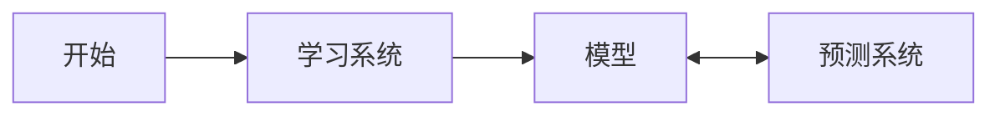

## 第1章 统计学习方法概论
本章简要叙述统计学习方法的一些基本概念.这是对全书内容的概括,也是全书内容的基础.首先叙述统计学习的定义,研究对象与方法;然后叙述统计学习,这是本书的主要内容;接着提出统计学习方法的三要素:模型,策略,算法;介绍模型选择,包括正则化,交叉验证与学习的泛化能力;介绍生成模型和判别模型;最后介绍监督学习方法的应用:分类问题,标注问题和回归问题.

### 1.1 统计学习

##### 1. 统计学习的特点
1. 统计学习以计算机及网络为平台,建立在计算机及网络上的;
2. 统计学习以数据为研究对象,是数据驱动的学科;
3. 统计学习的目的是对数据进行预测与分析;
4. 统计学习以方法为中心,统计学习方法构建模型并应用模型进行预测与分析;
5. 统计学习是概率论,统计学,信息论,计算理论,最优化理论及计算机科学等多个领域的交叉学科,并且在发展中逐步形成独立的理论体系与方法论.

赫尔伯特·西蒙(Herbert A. Simon)曾对"学习”给出以下定义:"如果一个系统能够通过执行某个过程改进它的性能,这就是学习.”统计学习就是计算机系统通过运用数据以及统计方法提高系统性能的机器学习.现在,机器学习一般就是指统计机器学习.

##### 2. 统计学习的对象
对象是数据(data).从数据出发,提取数据的特征,抽象出数据的模型,发现数据中的知识,又回到对数据的分析与预测中去.数据是多样的,各种数字,文字,图像,视频,音频以及它们的组合.
统计学习关于数据的基本假设是同类数据具有一定的统计规律性,可以用概率统计的方法来加以处理.例如:可以用随机变量描述数据中的特征,用概率分布描述数据的统计规律.

##### 3. 统计学习的目的
统计学习用于对数据进行预测与分析,特别是对位置新数据进行预测与分析.对数据的预测分析是通过构建概率统计模型实现的.所以,统计学习总的目标就是考虑学习什么样的模型和如何学习模型,以使模型能对数据进行准确的预测分析,同事也要考虑尽可能地提高学习效率.

##### 4. 统计学习的方法
统计学习的方法是基于数据构建统计模型从而对数据进行预测分析.统计学习有监督学习(supervised learning),费监督学习(unsupervised learning),半监督学习(semi-supervised learning)和强化学习(reinforcement learning)等组成.
这本书主要讨论监督学习,这种情况下统计学习的方法可以概况为:从给定的,有限的,用于学习的训练数据(training data)集合出发,假设数据是独立同分布产生的;并且假设要学习的模型属于某个函数的集合,称为假设空间(hypothesis space);应用某个评价准则(evaluation criterion),从假设空间中选取一个最优的模型,使它对已知训练数据以及未知测试数据(test data)在给定的评价准则下有最优的预测;最优模型的选取由算法实现.这样,统计学习方法包括模型的假设空间,模型选择的准则以及模型学习的算法,称其为统计学习方法的三要素:模型(model),策略(strategy)和算法(algorithm).

实现统计学习方法的步骤如下:
1. 得到一个有限的训练数据结婚;
2. 确定包含所有可能的模型的假设空间,即学习模型的结婚;
3. 确定模型选择的准则,即学习的策略;
4. 实现求解最优模型的算法,即学习的算法;
5. 通过学习方法选择最优模型;
6. 利用学习的最优模型对新数据进行预测分析.

##### 5. 统计学习的研究
统计学习研究一般包括统计学习方法(statistical learning method),统计学习理论(statistical learning theory)及统计学习应用(application of statistical learning)三个方面.

##### 6. 统计学习的重要性
近20年来,统计学习无论是在理论还是在应用上都取得了巨大的发展,有许多重大突破,已成功应用到人工智能,模式识别,数据挖掘,自然语言处理,语音识别,图像识别,信息检索和生物信息等许多计算机应用领域中,并且成为核心技术.
统计学习学科在科学技术中的重要性主要体现在以下几个方面:
1. 统计学习是处理海量数据的有效方法.
2. 统计学习是计算机智能化的有效手段.
3. 统计学习是计算机科学发展的一个重要组成部分.

### 1.2 监督学习
统计学习包括监督学习,费监督学习,半监督学习及强化学习.本书朱啊哟讨论监督学习.
监督学习(supervised learning)的任务是学习一个模型,使模型能够对任意给定的输入,对其相应的输出做出一个好的预测.

#### 1.2.1 基本概念
##### 1. 输入空间,特征空间与输出空间
在监督学习中,将输入与输出所有可能取值的集合分别成为输入空间(input space)和输出空间(output space).输入与输出空间可以使有限元数的集合,也可以是整个欧氏空间.可以使同一空间,也可以是不同空间;但通常输出空间远远小于输入空间.  
每个具体的输入是一个实例(instance),通常由特征向量(feature vector)表示.这是,所有特征向量存在的空间成为特征空间(feature space).特征空间的每一维对应一个特征.又是假设输入空间与特征空间是相同的空间,对他们不加区分;有时假设输入空间与特征空间为不同的空间,将实例从输入空间映射到特征空间(SVM).模型实际上都是定义在特征空间上的.  
在监督学习过程中,将输入与输出看作是定义在输入(特征)空间与输出空间上的随机变量的曲子.输入,输出变量用大写字母表示,习惯上输入变量写作X,输出变量写作Y.输入,输出变量索取的值用小写字母表示,输入x,输出y.变量可以使标量或向量.除特别声明外,书中向量皆为列向量,输入实例x的特征向量记为:

$$
    \boldsymbol{x} = (x^{(1)},x^{(2)},...,x^{(i)},...,x^{(n)})^T
$$

$x^{(i)}$表示x的第i个德政.注意,$x^{(i)}$与$x_i$不同,本书通常用$x_i$表示多个输入变量中的第i个,即:

$$
    \boldsymbol{x_i} = (x_i^{(1)},x_i^{(2)},...,x_i^{(i)},...,x_i^{(n)})^T
$$

监督学习从训练数据(training data)集合中学习模型,对测试数据(test data)进行预测.训练数据由输入(或特征向量)与输出对组成,训练集通常表示为:

$$
    T = {(\boldsymbol{x_1},y_1),(\boldsymbol{x_2},y_2),...,(\boldsymbol{x_N},y_N)}
$$

测试数据也由输入输出对组成.输入输出对又称为样本(sample)或样本点.  
输入变量X和输出变量Y有不同的类型,可以是连续的,也可以是离散的.人们根据输入,输出变量的不同类型,对预测任务与给予不同的名称:输入输出变量均为连续的预测问题成为<strong>回归问题</strong>;输出变量为有限个离散变量成为<strong>分类问题</strong>;输入输出变量均为变量序列成为<strong>标注问题</strong>.

##### 2. 联合概率分布
监督学习假设输入输出的随机变量X和Y遵循联合概率分布P(X,Y).P(X,Y)表示分布函数,或分布密度函数.注意,是假设联合概率分布存在,但具体定义是未知的.训练数据与测试数据被看做是依联合概率分布P(X,Y)独立同分布产生的.统计学习假设数据存在一定的统计规律,<strong>X和Y具有联合概率分布的假设就是监督学习关于数据的基本假设</strong>.

##### 3. 假设空间
监督学习的目的是学习一个由输入到输出的映射,这一映射由模型来表示.模型属于由输入空间到输出空间的映射的集合.这个集合即假设空间(hypothesis space).  
监督学习的模型可以是概率模型或非概率模型,由条件概率P(Y|X)或决策函数(decision function)Y=f(X)表示,随具体学习方法而定.对具体的输入进行相应的输出预测时,写作P(y|x)或y=f(x).

#### 1.2.2 问题的形式化

首先给出一个训练数据集

$$
    T = {(\boldsymbol{x_1},y_1),(\boldsymbol{x_2},y_2),...,(\boldsymbol{x_N},y_N)}
$$
其中$(\boldsymbol{x_i},y_i),i=1,2,...,N$称为样本或样本点.$\boldsymbol{x_i}\isin \mathcal{X}$
### 1.3 统计学习三要素

#### 1.3.1 模型

#### 1.3.2 策略

#### 1.3.3 算法

### 1.4 模型评估与模型选择

#### 1.4.1 训练误差与测试误差

#### 1.4.2 过拟合与模型选择

### 1.5 正则化与交叉验证

#### 1.5.1 正则化

#### 1.5.2 交叉验证

### 1.6 泛化能力

#### 1.6.1 泛化误差

#### 1.6.2 泛化误差上界

### 1.7 生成模型与判别模型

### 1.8 分类问题

### 1.9 标注问题

### 1.10 回归问题

