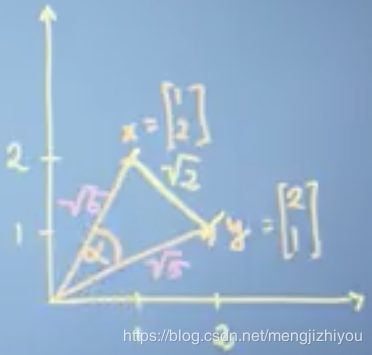
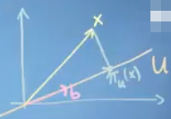
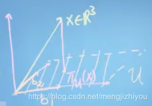
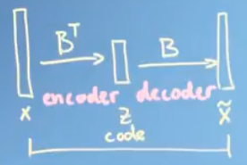

## PCA

PCA(用数学原理进行推导和解释)

在学PCA的时候总是提到根据方差选主成分,方差计算贡献率之类的,但一直不明白其中的原理,今天就来给大家解析一下.

首先是一些数学公式,大家可以找一些例子证明一下,这里就不证明了.

### 1,相关数学知识
#### 1.1 均值

$$
    \begin{aligned}
        E[a+x] &=a+E[x] 
        \\E[\alpha x] &=\alpha E[x] 
        \\E[\alpha x+a] &=\alpha E[x]+a 
    \end{aligned}
​$$

#### 1.2 方差

$$
    \begin{aligned}
        \mathrm{Var}[a+x] &=\mathrm{Var}[x] 
        \\\mathrm{Var}[\alpha x] &=\alpha^2\mathrm{Var}[x] 
        \\\mathrm{Var}[Ax+b] &=A\mathrm{Var}[x]A^T
    \end{aligned}
​$$

### 2,相关向量知识

#### 2.1 向量的长度

对于向量 $x,y$:$y=\sum_{i=1}^Nx_iy_i,x,y \in \mathbb{R}^N$,其中向量 $x=[1,2]$,向量 $y=[2,1]$,如下图所示.​​

向量 $x$ 的长度:$||x||=\sqrt{x^Tx}=\sqrt{\sum_{i=1}^Nx_i^2}=\sqrt{1^2+2^2}=\sqrt{5}$
向量 $y$ 的长度:$||y||=\sqrt{5}$

向量的距离(两点之间的距离):
$$
    \begin{aligned}
        d &=||x-y||=\sqrt{(x-y)^T(x-y)} 
        \\&=\left \| 
            \begin{bmatrix} 
                1\\
                2 
            \end{bmatrix}- 
            \begin{bmatrix} 
                2\\ 
                1 
            \end{bmatrix} 
        \right \|=\left \| 
            \begin{bmatrix} 
                -1\\ 
                1 
            \end{bmatrix}
        \right \|=\sqrt{1+1}=\sqrt{2}
    \end{aligned}
$$

向量之间的夹角:$\mathrm{cos} \alpha=\frac{x^Ty}{\left \| x \right \| \left \| y \right \|}=\frac{4}{5}\approx 0.64\mathrm{rad}$

#### 2.2 内积定义(inner product definition)

$x,y$ 都是向量即 $x,y\in V$,向量内积的表示: $<\cdot ,\cdot >=V*V,\in \mathbb{R}$

内积的属性:

对称性(symmetry):$<x,y>=<y,x>$

正定(positive definite):$<x ,x>\geq0,<x ,x> \geqslant 0$,当 $x=0$ 时 $<x,x>=0$

双线性(bilinear):对于 $x,y,z \in V,\lambda \in \mathbb{R}$
$$
    \begin{aligned}
        <\lambda x+z ,y> &=\lambda<x,y>+<z,y> \\
        < x ,\lambda y+z> &=\lambda<x,y>+<x,z>
    \end{aligned}
$$
上述两向量 $x,y$ 的点乘可以用内积表示为:
$$
    <x,y>=x^T\mathbf{I}y
$$
其中 $\mathbf{I}$ 是单位矩阵.

上述是正常情况下两向量之间的点乘(dot product),在内积中是这样定义的:
$$
    <x,y>=x^T\mathbf{A}y
$$
其中 $\mathbf{A}$是半正定矩阵

注:个人感觉内积是点乘的扩展,应用的范围更广一点.

若$\mathbf{A}=\begin{bmatrix} 2 &1 \\ 1 & 2 \end{bmatrix}$,则$<x,y>=x^T\mathbf{A}y=2x_1y_1+x_2y_1+x_1y_2+2x_2y_2$

内积定义下表示向量的长度和距离:

此时向量 $x$ 的长度为:
$$
    \begin{aligned}
        ||x||=\sqrt{<x,x>} &=\sqrt{2x_1x_1+x_2x_1+x_1x_2+2x_2x_2} \\
        &=\sqrt{2x_1^2+2x_2x_1+2x_2^2}=\sqrt{14}
    \end{aligned}
$$
此时,内积下的向量长度比点乘下的大.

向量的距离:
$$
    \begin{aligned}d=||x-y|| &=\sqrt{<x-y,x-y>} \\&=\sqrt{<x,x>-2<x,y>+<y,y>}\\&=\sqrt{14-2*14+14}=0\end{aligned}
$$

此时,内积下的向量距离与上面点乘下的距离不同.

由上可知,通过内积计算向量的长度和距离可以不同.

内积定义下的向量夹角:$\mathrm{cos} \alpha=\frac{<x,y>}{\left \| x \right \| \left \| y \right \|}$
注:在点乘下,两向量的夹角是90度,但在内积中两向量的夹角可能不是90度.

其他一些属性:

* $||\lambda x||=|\lambda|\left \| x \right \|$
* triangle inequality:$\leq \left \| x \right \|+\left \| y \right \|$
* Cauchy-Schwart inequality:$|<x,y>|\leq \left \| x \right \|\left \| y \right \|$
  
##### 2.2.1 函数和随机变量的内积:

###### 2.2.1.1 函数的内积(连续变量):
定义两个函数 $u$ 和 $v$,其在 $[a,b]$ 范围内的内积为:
$$
    <u,v>=\int _a^bu(x)v(x)\mathrm{d}x
$$
​	
如果积分为 0,则两个函数 $u$ 和 $v$ 正交(orthogonality).

若 $u(x)=sin(x)$,$v(x)=cos(x)$,则 $f(x)=u(x)v(x)$.

因为 $f(x)$ 是奇函数,所以在 $[-\pi,\pi]$ 范围内其积分为 0,即函数 $u$ 和 $v$ 正交.

###### 2.2.1.2 随机变量的内积(离散变量):
若两随机变量之间不相关:$\mathrm{var}[x+y]=\mathrm{var}[x]+\mathrm{var}[y]$

因为 $var$ 是平方所得,所以上式类似直角三角形定理 $c^2=a^2+b^2$,如下图所示(Pythagorean theorem),下图是几何解释.

$\color{Red}{不相关的两随机变量的内积为:}$ $<x,y>=cov[x,y]$,协方差满足内积 性.
$$
    \begin{aligned}cov[\lambda x+y,z] &=\lambda cov[x,z]+cov[y,z] \\\mathrm{cos} \alpha &=\frac{<x,y>}{\left \| x \right \| \left \| y \right \|}=\frac{\mathrm{cov}[x,y]}{\sqrt{\mathrm{var}[x]\mathrm{var}[y]}} \\||x|| &=\sqrt{cov[x,x]}=\sqrt{var[x]}=\sigma (x)\end{aligned}
$$
#### 2.3 向量的投影
##### 2.3.1 投影到一维空间:

如下图所示,设向量 $x$ 在 $u$ 上的投影为向量 $\pi_u(x)$则:

* $\pi_u(x) \in u \Rightarrow \exists \lambda \in \mathbb{R}:\pi_u(x)=\lambda b$
* 向量x在u上的投影向量正交于向量 $\pi_u(x)-x$,则 $\left \langle b,\pi_u(x)-x \right \rangle=0$
* 为什么是正交,因为只有正交时,向量x在u上的投影最大,与x向量的长度最接近
$$
    \begin{aligned}&\left \langle b,\pi_u(x)-x \right \rangle=0 \\\Rightarrow &\left \langle b,\pi_u(x) \right \rangle -\left \langle b,x \right \rangle =0\\\Rightarrow &\left \langle b,\lambda b \right \rangle -\left \langle b,x \right \rangle =0\\\Rightarrow &\lambda ||b||^2-<b,x>=0\\\Rightarrow &\lambda=\frac{<b,x>}{||b||^2}\\\Rightarrow &\pi_u(x)=\lambda b = \lambda=\frac{<b,x>}{||b||^2}b=\frac{b^Txb}{||b||^2}=\frac{bb^T}{||b||^2}x\end{aligned}
$$
式中 $\frac{bb^T}{||b||^2}$是投影矩阵.

假设 $||b||=1$,则$\lambda=<b,x>=b^Tx$,$\pi_u(x)=b^Txb=bb^Tx$.

例:若$\vec{b}=\begin{bmatrix} 2\\ 1 \end{bmatrix},\vec{x}=\begin{bmatrix} 1\\ 2 \end{bmatrix}$(下图所示),则$\pi_u(x)=\frac{b^Tx}{||b||^2}b=\frac{4}{5} \begin{bmatrix} 2\\ 1 \end{bmatrix}$,即向量x在u上的投影长度为 $||\pi_u(x)||=\frac{4}{5}||b||$.

##### 2.3.2 投影到高维空间:

假设向量 $x$ 是三维向量即 $x \in \mathbb{R}^3$,将其投影到二维空间上,特征(降维)空间 $u=[b_1,b_2]$,如下图所示:

则向量 $x$ 在 $u$ 平面上的投影长度为:$\pi_u(x)=\lambda_1b_1+\lambda_2b_2$,则有:
$$
    \begin{aligned}\left \langle b_1,\pi_u(x)-x \right \rangle=0 \\\left \langle b_2,\pi_u(x)-x \right \rangle=0\end{aligned}
$$
$D$ 维空间投影到 $M$ 维空间的一般形式:$\lambda=[\lambda_1,...,\lambda_M]^T,M\times 1$,$M×1$,$B=[b_1|...|b_M]^T,D \times M$
1. $\pi_u(x)=\sum_{i=1}^M\lambda_ib_i$(成分的线性组合)
2. $\left \langle b_i,\pi_u(x)-x \right \rangle=0,i=1,...,M$(正交)
$$
    \begin{aligned}\pi_u(x) &=B \lambda \\\left \langle b_i,B \lambda \right \rangle-\left \langle b_i,x \right \rangle &=0\\\lambda^TB^Tb_i-x^T b_i &=0\\\lambda^TB^TB-x^TB &=0\\\lambda^T &=x^TB(B^TB)^{-1}\\\lambda &=(B^TB)^{-1}B^Tx\\\pi_u(x) &=B \lambda=B(B^TB)^{-1}B^Tx=BB^Tx\end{aligned}
$$
$B(B^TB)^{-1}B^T$是投影矩阵(projection matrix).

例:三维投影到二维上 $\vec{x}=[2,1,1]^T,b_1=[1,2,0]^T,b_2=[1,1,0]^T,u=[b_1,b_2]$,求其投影,如下图所示:

因为 $b_1=[1,2,0]^T,b_2=[1,1,0]^T$ 的第三维均为 0,所以 $u$ 是一个二维平面(图中向上的箭头是第三维数据).

由上得:

$$
    \begin{aligned}\pi_u(x) &=B \lambda \\B=[b_1|b_2] &=\begin{bmatrix} 1 & 1\\ 2 &1 \\ 0 & 0 \end{bmatrix} \\B^Tx &=\begin{bmatrix} 4\\ 3 \end{bmatrix} \\ B^TB &=\begin{bmatrix} 5 &3 \\ 3 & 2 \end{bmatrix}\end{aligned}
$$

$$
    \begin{aligned}\lambda &=(B^TB)^{-1}B^Tx \\B^TB \lambda &=B^Tx \\\lambda &=\begin{bmatrix} -1\\ 3 \end{bmatrix} \\\pi_u(x) &=-1\times b_1+3\times b_2=\begin{bmatrix} 2\\ 1\\0 \end{bmatrix}\end{aligned}
$$
由上所得,投影向量 $\pi_u(x)$ 是一个三维向量,但其第三个成分是 0 ,虽然是个三维向量,但是可以用二维坐标表示.上面的 $b_1,b_2$ 的第三成分也是0,这就是将向量x从多维降到低维空间的压缩原理.

### 3,PCA

#### 3.1 PCA 原理

假设 $X= { x_1,…,x_N }$,$x_i \in \mathbb{R}^D$,PCA 的目标是找到一个低维空间能够表示数据并尽可能的与 $X$ 相似.

再了解PCA之前,先了解一些概念:

1. $D$ 维空间的向量可以用基向量(basis vectors)的线性组合表示:$x_n=\sum_{i=1}^D \beta_{in}b_i$,这里的基向量是指D维空间中的向量,类似坐标轴.
2. 由 1 可知:$\beta_{in}=x_n^Tb_i$
3. 从 $D$ 维空间中选择前 $M$ 个 $b_i$作为正交基础向量(orthogonality basis vectors),即 $B=[b_1|...|b_M]$,向量 $x$ 的投影向量为:$\widetilde{x}=BB^T$, $B^Tx$ 叫做 coord or code.

PCA的主要想法是找到一个低维,可以用更少的基向量组成的 $\widetilde{x}_n$ 表示 $x_n$,假设在M维空间中数据是中心化的,即数据的均值为0($E(x)=0$).假设 $b_1\sim b_D$ 是 $\mathbb{R}^D$ 的正交基础向量,则:

向量 $x_n$ 在 $M$ 维空间的投影为:$\widetilde{x}_n=\sum_{i=1}^M \beta_{in}b_i+\sum_{i=M+1}^D \beta_{in}b_i,\widetilde{x}_n \in \mathbb{R}^D$

在PCA中会忽视第二项,所以$\widetilde{x}_n=\sum_{i=1}^M \beta_{in}b_i,\widetilde{x}_n \in \mathbb{R}^D$

基向量 $b_1\sim b_D$ 构成的子空间叫做 principle subspace, 即 $b_1\sim b_D$ span the principle subspace.

虽然 $\widetilde{x}_n$ 是 $D$ 维向量,但是存在于 $D$ 维的子空间 $M$ 维中.

上述中需要调节的参数有 $\beta_{in},b_i$,对此可以构建平方差损失函数求得:$J=\frac{1}{N}\sum_{n=1}^N\left \| x_n,\widetilde{x}_n \right \|^2$

找到最优的基向量,对 $\beta_{in},b_i$ 求偏导数,令其偏导数为 0,即可求得.

除了令偏导数为 0 进行参数优化,还可以用 chain rule 进行优化:
$$
    \begin{aligned}
        \frac{\partial J}{\partial \left\{ \beta_{in},b_i \right\} } &=\frac{\partial J}{\partial \widetilde{x}_n}\times \frac{\partial \widetilde{x}_n}{\partial \{ \beta_{in},b_i \} }
        \\\Rightarrow \frac{\partial J}{\partial \widetilde{x}_n} &=-\frac{2}{N}(x_n-\widetilde{x}_n)^T
        \\\Rightarrow \frac{\partial \widetilde{x}_n}{\partial\beta_{in}} &=b_i,i=1,...,M
    \end{aligned}
$$

$$
    \begin{aligned}
        \frac{\partial J}{\partial \beta_{in}}=\frac{\partial J}{\partial    \widetilde{x}_n}\times \frac{\partial \widetilde{x}_n}{\partial \beta_{in}}&=-\frac{2}{N}(x_n-\widetilde{x}_n)^Tb_i 
        \\&=-\frac{2}{N}(x_n-\sum_{i=1}^M \beta_{in}b_i)^Tb_i 
        \\&=-\frac{2}{N}(x_n^Tb_i-\beta_{in}b_i^Tb_i),b_i^Tb_i=1
        \\&=-\frac{2}{N}(x_n^Tb_i-\beta_{in})=0
        \\&\Rightarrow \beta_{in}=x_n^Tb_i
    \end{aligned}
$$

下面重构损失函数,这样更加方便找到基向量.

$$
    \begin{aligned}
        \widetilde{x}_n &=\sum_{i=1}^M \beta_{in}b_i 
        \\&=\sum_{i=1}^M (x_n^Tb_i)b_i 
        \\&=\sum_{i=1}^M (x_n^Tb_i)b_i 
        \\&=(\sum_{i=1}^M b_ib_i^T)x_n
    \end{aligned}
$$

$\sum_{i=1}^M b_ib_i^T$是投影矩阵.

$$
    \begin{aligned}
        x_n &=\sum_{i=1}^M \beta_{in}b_i+\sum_{i=M+1}^D \beta_{in}b_i 
        \\&=(\sum_{i=1}^M b_ib_i^T)x_n+(\sum_{i=M+1}^D b_ib_i^T)x_n
    \end{aligned}
$$

$\widetilde{x}_n$ 与 $x_n$ 相比少了第二项,所以 $\widetilde{x}_n$ 是 $x_n$ 的近似值(approximation).

原始向量减去投影向量,即:

$$
    \begin{aligned}
        x_n-\widetilde{x}_n &=(\sum_{i=M+1}^D b_ib_i^T)x_n 
        \\&=\sum_{i=M+1}^D (b_i^Tx_n)b_i
    \end{aligned}
$$

从上式可以看出两向量之差位于我们忽视的子空间里,即不包含主要子空间,该子空间是主要子空间的正交互补空间.

由上,损失函数可以重新定义为:
$$
    \begin{aligned}
        J &=\frac{1}{N}\sum_{n=1}^N \left \| x_n,\widetilde{x}_n \right \|^2 
        \\&=\frac{1}{N}\sum_{n=1}^N\left \| \sum_{i=M+1}^D (b_i^Tx_n)b_i \right \|^2 
        \\&=\frac{1}{N}\sum_{n=1}^N \sum_{i=M+1}^D (b_i^Tx_n)^2 
        \\&=\frac{1}{N}\sum_{n=1}^N \sum_{i=M+1}^D b_i^Tx_nx_n^Tb_i 
        \\&=\frac{1}{N}\sum_{n=1}^N \sum_{i=M+1}^D b_i^Tx_nx_n^Tb_i 
        \\&=\sum_{i=M+1}^D b_i^T(\frac{1}{N} \sum_{n=1}^Nx_nx_n^T)b_i,S =\frac{1}{N} \sum_{n=1}^Nx_nx_n^T,S是协方差矩阵 
        \\&=\sum_{i=M+1}^D b_i^TSb_i 
        \\&=trace((\sum_{i=M+1}^D b_ib_i^T)S)
    \end{aligned}
$$

$\sum_{i=M+1}^D b_ib_i^T$ 是投影矩阵(projection matrix),这个投影矩阵将数据协方差投影到主要子空间(principle subspace)的互补空间中,意味着重构的损失函数是将数据的方差投影到我们忽视的子空间去,因此最小化损失函数等价于最小化数据在忽视的空间的方差.

若 $b_1$ 是 principle subspace,$b_2$ 是 orthogonal complement(the space we ignore),则:

$$
    b_i^Tb_j=\delta_{ij}=
    \begin{cases}
        1\qquad i=j\\
        0\qquad i\not ={j}
    \end{cases}
$$

最小化(S):
$$
    J=\sum_{i=M+1}^D b_i^TSb_i= b_2^TSb_2
$$

约束:
$$
    b_2^Tb_2=1
$$

根据[拉格朗日乘子](https://blog.csdn.net/mengjizhiyou/article/details/103437410)得:

$$
    \begin{aligned}
        L&=b_2^TSb_2+\lambda(1-b_2^Tb_2) 
        \\\Rightarrow \frac{\partial L}{\partial \lambda} &=1-b_2^Tb_2=0\Leftrightarrow b_2^Tb_2=1 
        \\\Rightarrow \frac{\partial L}{\partial b_2} &=2b_2^TS-2\lambda b_2^T=0\Leftrightarrow Sb_2=\lambda b_2
    \end{aligned}
$$

因此:$J= b_2^TSb_2=b_2^Tb_2 \lambda= \lambda$ ($\lambda$ 是数据的协方差矩阵的特征值).

当 $\lambda$ 是最小特征值时,平方损失函数是最小的,意味着 $b_2$ 是我们忽视的空间的对应的特征向量,$b_1$ 是主要子空间是数据协方差矩阵的最大特征值的特征向量.$b_1,b_2$ 之间是正交的,因为协方差矩阵是对称的.

损失函数的一般形式:

$$
    \begin{aligned}
        Sb_i &=\lambda_ib_i,i=M+1,..,D 
        \\J &=\sum_{i=M+1}^D \lambda_i
    \end{aligned}
$$

当取的基向量(base vector)是被忽视子空间的数据协方差的最小特征值的特征向量时,损失函数是最小化; 这相当于主要子空间是由数据协方差矩阵的M个最大特征值的特征向量组成.大的特征值对应大的方差,方差方向由特征向量给出.

主要子空间是标准正交的(orthonormal ),协方差矩阵的特征向量与大的特征值之间是相关的.

#### 3.2 PCA 运用注意点
PCA算法中需要计算数据的协方差矩阵(数据的协方差矩阵是不稳定,因此需要中心化(中心化不等于归一化))以及对数据进行中心化处理(均值为0(新的数据值=数据值-均值)).中心化并不影响数据之间的相关性.

$D$ 维空间的协方差矩阵是 $D \times D$ 的矩阵,若 $D$ 是高维的,则计算协方差矩阵的特征值和特征向量是昂贵的,因此可以对协方差矩阵进行处理.

假设数据点是少于纬度的,即数据点为 $x_1,...,x_N \in \mathbb{R}^D$,$X=\begin{bmatrix} x_1^T\\ ... \\ x_N^T \end{bmatrix} \in \mathbb{R}^{N \times D}$,其中 $N<D$.

$S=\frac{1}{N}X^TX$,$S$ 的秩为 $N$,即 $rank(S)=N$,所以有 $D-N+1$ 个值为0特征值,即矩阵不是满秩(矩阵的行列之间是线性相关的(linearly dependent)即矩阵中有一些重复(redundancies)).

接下来让 $D \times D$ 的协方差矩阵变成满秩的,即矩阵中不存在为 0 的特征值.

$$
    \begin{aligned}
        Sb_i &=\lambda_ib_i,i=M+1,..,D 
        \\\frac{1}{N}X^TXb_i &=\lambda_ib_i 
        \\\frac{1}{N}{\color{Red} X}X^TXb_i &=\lambda_i{\color{Red} X}b_i (两边同乘一个X) 
        \\\frac{1}{N}XX^Tc_i &=\lambda_ic_i (Xb_i=c_i,\frac{1}{N}XX^T \in \mathbb{R}^{N \times N})
        \\\frac{1}{N}{\color{Red} X^T}XX^Tc_i &=\lambda_i{\color{Red} X^T}c_i(两边同乘一个X^T)
        \\SX^Tc_i &=\lambda_i{\color{Red} X^T}c_i
    \end{aligned}
$$

$S=\frac{1}{N}{\color{Red} X^T}N \in\mathbb{R}^{N \times N}$,计算 的协方差矩阵要比计算 $D\times D$ 的代价小.

#### 3.3 PCA 的其它解释

如上图所示,高维向量 $X$ 通过基向量 ($B^T$) 投影到低维空间 $Z$($=B^TX$).$B$ 矩阵的列是数据协方差矩阵的特征向量,这些特征向量对应着大的特征值,$Z$ 值是数据点相对于基向量的坐标,这些坐标对应着主要子空间,$Z$ 也叫数据点的 code.低维的也可以转向高维,通过 $BZ$ 即可将 $Z$ 转换到原来的数据空间.

通过构建平方差函数来找到PCA的最优参数,可将PCA看做是线性自动编码(linear auto encoder).自动编码(autoencoder)对数据点X进行编码(encode)然后试图将其解码(decode)成一个类似X的数据点.将数据点映射到code叫做 encoder.将 code 映射到原始数据空间叫做 decoder.

若 encoder 和 decoder是线性映射,则PCA参数优化方法是用平方差损失函数;若将线性映射(linear mapping)换成非线性映射 (non-linear mapping),则得到 non-linear autoencoder,如在深度自动编码器中,用深度网络代替编码器和解码器.自动编码 器的损失函数叫做 encoding loss.

PCA的另一个解释与信息论有关.可以将code看做是原数据点被压缩的版本,当用code重构原数据点时,不会得到与原始数据点完全一样的数据点,会得到一个稍微失真或有噪声的版本,意味着压缩直观上是有损的.压缩是通过最大化原始数据点与低维的code之间的相关性,这跟 mutual information 相关.类似PCA损失函数的最优化,这里是最大化 mutual information.mutual information是信息论里一个重要的概念.在重构损失函数中,PCA是最小化数据在正交互补空间的方差,等价于最大化数据在主要子空间的方差.在信息论中最大化 mutual information 就是最大化方差,可以解释为尽可能的保留信息.

从隐藏变量模型(latent vatiable model)的角度看,Z是一个未知的低维空间,这个未知空间与 $X$ 存在线性关系,因此X可以写成 $X=BZ+\mu+\epsilon$:,假设噪声 $\epsilon$ 是各向同性的(isotropic),则 $\epsilon \sim N(0,\sigma^2\mathrm{I})$.进一步假设Z的分布式标准正态分布,即 $p(Z)=N(0,\mathrm{I})$.由上可以写出模型的似然函数:

$$
    \begin{aligned}
        p(X|Z) &=N(X|BZ+\mu,\sigma^2\mathrm{I}) 
        \\p(X) &=\int p(X|Z)p(Z)dZ 
        \\&=N(X|\mu,BB^T+\sigma^2\mathrm{I})
    \end{aligned}
$$

模型的参数有 $B,\mu,\epsilon$,可以用最大似然估计求参数,发现 $\mu$ 是数据点的均值, B是包含与最大特征值相关的特征向量的矩阵.

$$
    p(Z)p(X)p(Z|X)=\frac{p(X|Z)p(Z)}{p(X)}
$$

为得到数据在低维空间的code,可以用贝叶斯理论,将 $Z$ 和 $X$ 之间的线性关系进行转换.

相关资料推荐:

1. [夹角计算的推导](https://www.cnblogs.com/MCSFX/p/11738463.html)
2. [协方差和相关性描述](https://ocw.mit.edu/courses/mathematics/18-05-introduction-to-probability-and-statistics-spring-2014/readings/MIT18_05S14_Reading7b.pdf)
3. [矩阵秩的定义和求解](https://www.easycalculation.com/matrix/matrix-rank.php)

参考:
intrigano(Mathematics for Machine Learning - PCA )