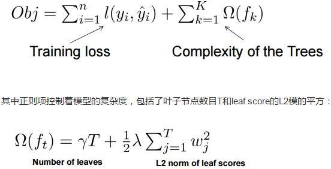
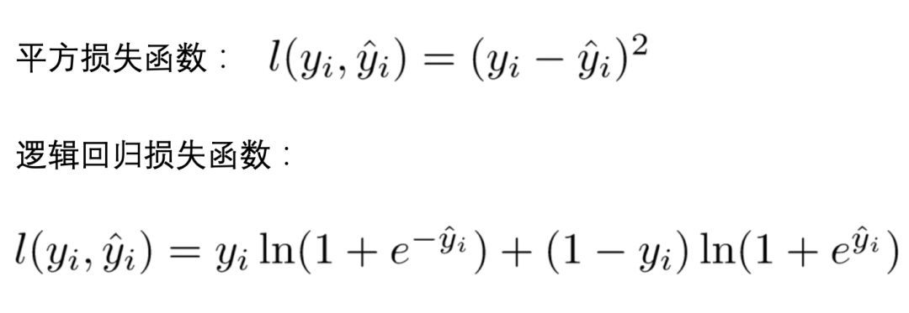
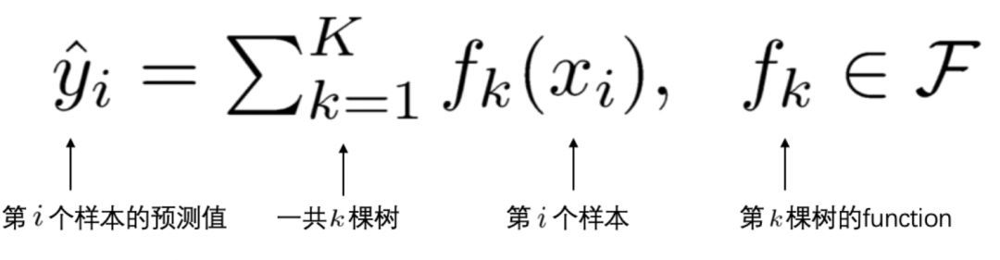
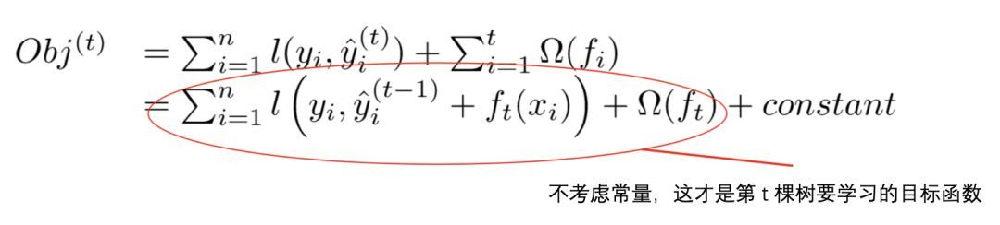
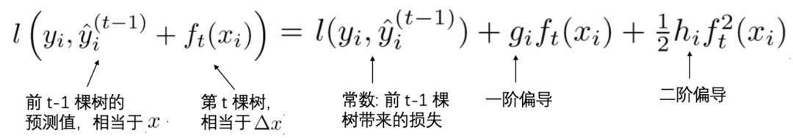

## XGBoost推导
* XGB中树节点分裂的依据是什么?
* 如何计算树节点的权值?
* 为防止过拟合,XGB做了哪些改进?

相信看到这篇文章的各位对XGBoost都不陌生,的确,XGBoost不仅是各大数据科学比赛的必杀武器,在实际工作中,XGBoost也在被各大公司广泛地使用.

如今算法岗竞争日益激烈,面试难度之大各位有目共睹,面试前背过几个常见面试题已经远远不够了,面试官通常会"刨根问底",重点考察候选人对模型的掌握深度.因此,对于XGBoost,你不仅需要知其然,而且还要知其所以然.

本文重点介绍XGBoost的推导过程,文末会抛出10道面试题考验一下各位,最后准备了一份"XGB推导攻略图”,帮助你更好的掌握整个推导过程.

### 【1】XGB目标函数
XGBoost的目标函数由训练损失和正则化项两部分组成,目标函数定义如下:

变量解释:

(1)$l$ 代表损失函数,常见的损失函数有:

逻辑回归损失函数的其他表达形式:
$$
    \begin{aligned}
        l(y_i,\hat{y}_i)&=y_i\ln(1+e^{-\hat{y}_i})+(1-y_i)\ln(1+e^{\hat{y}_i})\\
        &= \ln(1+e^{\hat{y}_i})+y_i\ln(\frac{1+e^{-\hat{y}_i}}{1+e^{\hat{y}_i}})\\
        &=\ln(1+e^{\hat{y}_i})-y_i\hat{y}_i\\
        &=\ln(1+e^{\boldsymbol{w}^T\boldsymbol{x_i}})-y_i\boldsymbol{w}^T\boldsymbol{x_i}
    \end{aligned}
$$

(2)$y_i'$ 是第 $i$ 个样本 $x_i$ 的预测值.由于XGBoost是一个加法模型,因此,预测得分是每棵树打分的累加之和.

(3)将全部 $K$ 棵树的复杂度进行求和,添加到目标函数中作为正则化项,用于防止模型过度拟合.
$$
    \sum_{k=1}^K\Omega(f_k)
$$

### 【2】学习第t棵树
在【1】中提到,XGBoost 是一个加法模型,假设我们第t次迭代要训练的**树模型**是 $f_t(x)$ ,则有:

树模型$f_t(x)$ 是什么?具体是什么形式?

将上式带入【1】中的目标函数 $Obj$ ,可以得到:

注意上式中,**只有一个变量**,那就是第 $t$ 棵树:
$$
    f_t(x_i)
$$
其余的都是已知量或可通过已知量可以计算出来的(注意要理解哦!).

细心的同学可以发现,这里我们将正则化项进行了拆分,由于**前 t-1 棵树的结构已经确定**,因此,**前 t-1 棵树的复杂度之和可以用一个常量表示**:

### 【3】泰勒公式展开
首先简单回忆一下,泰勒公式.

泰勒公式是将一个在 $x = x_0$ 处具有n阶导数的函数 $f(x)$ 利用关于 $(x-x_0)$ 的n次多项式来逼近函数的方法.

泰勒公式的二阶展开形式如下:
$$
    f(x+\Delta x)\simeq f(x) + f'(x)\Delta x + \frac{1}{2}f''(x)\Delta x^2
$$
回到我们的问题上来,$f(x)$ 对应于我们的损失函数 $l$ ,$x$ 对应于前 $t-1$ 棵树的预测值,$\Delta x$ 对应于我们正在训练的第 $t$ 棵树.

首先定义损失函数 $l$ 关于 $y'(t-1)$ 的一阶偏导数和二阶偏导数:
$$
    g_i=\partial_{\hat{y}^{(t-1)}}l(y_i,\hat{y}^{(t-1)}),\quad
    h_i=\partial_{\hat{y}^{(t-1)}}^2l(y_i,\hat{y}^{(t-1)})
$$
那么,我们的损失函数就可以转化为下式(标出了与泰勒公式中 $x$ 和 $\Delta x$ 的对应关系).

为什么前 $t-1$ 棵树带来的损失 $l(y_i,\hat{y}_i^{(t-1)})$ 是常量. 

$$
    Obj^{(t)}\simeq\sum_{i=1}^n\left[l(y_i,\hat{y}_i^{(t-1)})+g_if_t(x_i)+\frac{1}{2}h_if_t^2(x_i)\right]+\Omega(f_t)+constant
$$

将上述二阶展开式,带入到【2】中的目标函数 $Obj$ 中,可以得到目标函数 $Obj$ 的近似值:

**去掉全部常数项**,得到目标函数:

### 4. 定义一颗树

我们重新定义一颗树,包括两个部分:
* 叶子结点的权重向量 $w$ ;
* 实例 $\rightarrow$ 叶子结点 的映射关系 $q$(本质是树的分支结构);
  
一棵树的表达形式定义如下:

