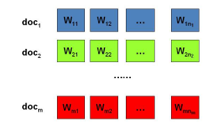
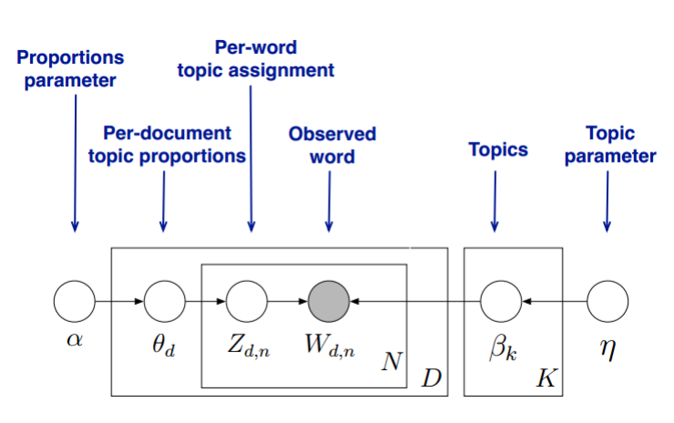

## LDA模型
本篇主要总结隐含狄利克雷分布(Latent Dirichlet Allocation,以下简称LDA)

### 1.贝叶斯定理
贝叶斯定理是关于随机事件A和B的条件概率的定理.
$$
    P(A|B)=\frac{P(A)\times P(B|A)}{P(AB)}
$$
在贝叶斯定理中:
P(A|B)是在事件B发生的条件下事件A发生的条件概率,也由于得自B的取值而被称作A的后验概率.  
P(A)是A的先验概率(或边缘概率).之所以称为"先验"是因为它不考虑任何B方面的因素.  
P(B|A)是在事件A发生的条件下事件B发生的条件概率,也由于得自A的取值而被称作B的后验概率.  
P(B)是B的先验概率或边缘概率. 
#### 理解:为什么称P(B|A)为B事件的后验概率?
例子:假设高中学校男女比例1:1,我们看到从校园出来10人7男3女,再来估计这所高中的男女比例.

首先B事件为男生,P(B)为先验概率,先验概率即我们先验知识的估计,当我们不知道学校男女比例的时候,我们假设男女比例是相等的,即先验概率P(B)为0.5,事件A是我们看到的从校园走出来的10人7男3女,P(B|A)是在事件A发生的条件下,即当事件A发生后我们再去估计P(B|A)的概率值,即后验概率,即观察到事件A的7男3女事实后(即我们的训练集数据)我们就会感觉这个学校的男生比女生的人数多,所以P(B|A)就会偏向于男生多的概率即后验概率.我们观察到的事件A,就认为男女的概率分布应该是偏向于A事件发生的概率,P(B)为男生概率设为\theta,观察到事件A即似然函数是$\binom{10}{7}\Theta ^{7}\left ( 1-\Theta \right )^{3}$,即先验概率+观察到数据=后验概率先验概率+观察到数据=后验概率.

按这些术语,叶斯定理可表述为:
后验概率 = (似然性*先验概率)/标准化常量
后验概率与先验概率和相似度的乘积成正比.

另外,P(B|A)/P(B)也有时被称作标准似然度(standardised likelihood),贝叶斯定理可表述为:
后验概率 = 标准似然度*先验概率
#### 举例:
假设高中学校里男女比例1:1,女生中文科比例为0.8,男生中文科生比例为0.2,计算随机一个学生是文科生则该生是女生的概率.

分析:
A1为学生为女生,A2表示学生是男生,B1表示学生是文科生,B2表示学生为理科生.
P(A1|B1)即为学生为文科生下为女生的概率.

已知:
$$
    \begin{aligned}
        &P(A_1) = 0.5, P(A_2) = 0.5, P(B_1|A_1) = 0.8, P(B_1|A_2) = 0.2\\
        &则:p(B_1)=P(B_1|A_1)\times P(A_1)+P(B1|A2)\times P(A_2) = 0.5\\  
        &P(A_1|B_1) = \frac{P(B_1|A_1)\times P(A_1)}{P(B_1)}=0.8  
    \end{aligned}
$$
### 2.二项式分布和共轭分布
#### 2.1 二项式分布
二项分布(Binomial Distribution),即重复n次的伯努利实验.二项分布公式如果事件发生的概率是p,则不发生的概率q=1-p,N次独立重复实验中发生K次的概率是
$$
    Binom(k|n,p)=\dbinom{n}{k}p^k(1-p)^{n-k}
$$
二项式分布用来估计观察到的事实的概率为观察到事件A即为似然函数,p为男生的比例,k为观察事件中男生的个数,n为观察到的人数总数.
#### 2.2 共轭分布
当先验分布和后验分布为同一分布时,先验分布(后验分布)与似然分布为共轭分布.

二项式分布的共轭分布是Beta分布,Beta分布概率密度函数表达式为:
$$
    Beta(p|\alpha,\beta)=\frac{\Gamma(\alpha+\beta)}{\Gamma(\alpha)+\Gamma(\beta)}p^{\alpha-1}p^{\beta-1}
$$
其中$\Gamma$是Gamma函数,是阶乘函数在实数与复数上的扩展表达式:
$$
    \begin{aligned}
        &\Gamma(x)=\int_0^{+\infty}e^{-t}t^{x-1}dt\   (x>0)\\
        &\Gamma(x+1)=x\Gamma(x)\\
        &\Gamma(x)=(x-1)!  (x\isin N^+)
    \end{aligned}
$$
beta分布可以看作一个概率的概率分布,它可以给出了所有概率出现的可能性大小.

后验概率$P\left ( p|n,k,\alpha ,\beta \right )$推导如下:
$$
    \begin{aligned}
        P(p|n,k,\alpha,\beta)\propto&P(k|n,p)P(p|\alpha,\beta)\\
        &=Binom(k|n,p)Beta(p|\alpha,\beta)\\
        &=\dbinom{n}{k}p^k(1-p)^{n-k}\times \frac{\Gamma(\alpha+\beta)}{\Gamma(\alpha)\Gamma(\beta)}p^{\alpha-1}(1-p)^{\beta-1}\\
        &\propto p^{k+\alpha-1}(1-p)^{n-k+\beta-1}
    \end{aligned}
$$
归一化后,得到后验概率:
$$
    P(p|n,k,\alpha,\beta)=\frac{\Gamma(\alpha+\beta)}{\Gamma(\alpha)\Gamma(\beta)}p^{k+\alpha-1}(1-p)^{n-k+\beta-1}
$$
Beta分布的期望:
$$
    \begin{cases}
        E(Beta(p|\alpha,\beta))&=\int_0^1tBeta(p|\alpha,\beta)dt\\
        &=\int_0^1\frac{\Gamma(\alpha+\beta)}{\Gamma(\alpha)\Gamma(\beta)}t^{\alpha}(1-t)^{\beta-1}\\
        &=\frac{\Gamma(\alpha+\beta)}{\Gamma(\alpha)\Gamma(\beta)}
        \frac{\Gamma(\alpha+1)\Gamma(\beta)}{\Gamma(\alpha+\beta+1)}\\
        &=\frac{\alpha}{\alpha+\beta}
    \end{cases}
$$
Beta分布的方差:
$$
    Var(X)=E(X-\mu)^2=\frac{\alpha\beta}{(\alpha+\beta)^2(\alpha+\beta+1)}
$$
#### 2.3 延伸多项式和Dirichlet分布
上面的例子中只有男生女生两类分类,如果我们要分类出文科生,理科生和艺术生三类呢,那么就是三项式,现实中存在根据多维的分类,那么我们就能得到多项式分布,而多项的共轭分布则称为Dirichlet分布.

根据二项式我们可以推出多项式分布为k时,表达式为:
$$
    multi(m_1,\cdots,m_k|n,p_1,\cdots,p_k)=\frac{n!}{m_1!,\cdots,m_k!}p_1^{m_1}\times\cdots\times p_k^{m_k},
$$
其中$m_{1}+\cdots+m_{k}=n,p_{1}+\cdots+p_{k}=1$

k维多项式分布的共轭分布为k维Dirichlet分布:
$$
    Dirichlet=\frac{\Gamma \left ( \sum_{k=1}^{k}\alpha _{k} \right )}{\prod_{k=1}^{k}\Gamma (\alpha _{k})}\prod_{k=1}^{k}p_{k}^{\alpha _{k}-1}
$$
其中$p_{1}+\cdots+p_{k}=1$

Dirichlet分布的期望为:
$$
    E(Dirchlet(\vec{p}|\vec{\alpha }))=(\frac{\alpha _{1}}{\sum_{k=1}^{K}\alpha _k},,,\frac{\alpha _{k}}{\sum_{k=1}^{K}\alpha _{k}})
$$
### 3. LDA主题模型
已知条件:我们有M篇文档,对应第d个文档中有$N_{d}$个词.如图:

	

问题:找到每一篇文档的主题分布和每一个主题中词的分布.

首先我们假设主题模型的个数K,那么LDA模型的解决方案为如下图:

	

每一篇文档的主题分布和每一个主题中词的分布是两个独立的分布,我们可以分别假设.  

Dirichlet分布是多项式的概率分布,我们目的是得到文档在各个主题的分布概率,所以对任意一文档d,我们可以使用Dirichlet分布作为主题分布$\theta _{d}$的先验分布:
$$
    \theta_{d}=Dirichlet(\vec{\alpha })
$$
其中,$\alpha$为分布的超参数,是一个K维向量,$\theta _{d}$为K维向量是文档d在属于K个主题的概率,$\theta _{d}^{1}+\cdots+\theta _{d}^{k}=1$.

对于任意一篇文档d的多项式分布(似然函数),根据这篇文档的各个词的主题分布,修正主题分布,我们可以使用多项式分布来从主题分布$\theta _{d}中得到这篇文档主题z_{d,n}$的分布为:
$$
    z_{d,n}=multi(\theta _{d})
$$
如果在第d个文档中标记为第k个主题的词中个数为n_{d}^{k},对应k个主题的个数表示为:
$$                                                                          \vec{n}_{d}=(n_{d}^{1},,,n_{d}^{k})
$$
根据Dirichlei共轭分布的特性可以推出:
$$                                                                          \theta _{d}=Dirichlet(\theta _{d}|\vec{\alpha }+\vec{n}_{d})
$$
其中,$\eta$为分布的超参数,是个V维向量,V是所有文档中的所有词的个数,$\beta _{k}$是V维向量是主题k对应所有词的概率,$\beta _{k}^{1}+,,,+\beta _{k}^{v}=1$.

对于任意一个主题k,其词分布我们也可以假设为Dirichlet分布:
$$
    \beta _{k}=Dirichlet(\vec{\eta })
$$
我们看到的词w_{k}的多项式分布:
$$
    w_{k}=multi(\beta _{k})
$$
我们记第k个主题中第v个词的个数为n_{k}^{v},则主题k中含全部词的分别得个数为:
$$
    \vec{n}_{k}=(n_{k}^{1},,,n_{k}^{v})
$$
利用共轭性质,得到$\beta _{k}$后验分布:
$$
    Dirichlet(\beta _{k}|\vec{\eta }+\vec{n}_{k})
$$
首先$\alpha,\beta$是我们先验分布的超参数,即是根据先验知识决定,选择合适的主题数K,然后根据数据文档,不断更新$\alpha,\beta$超参数.

参考资料:

https://www.zhihu.com/question/30269898

https://www.cnblogs.com/pinard/p/6831308.html
