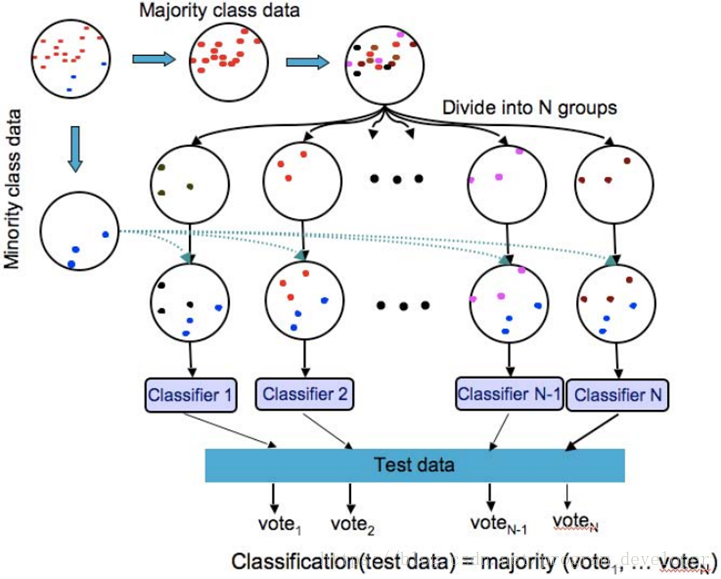
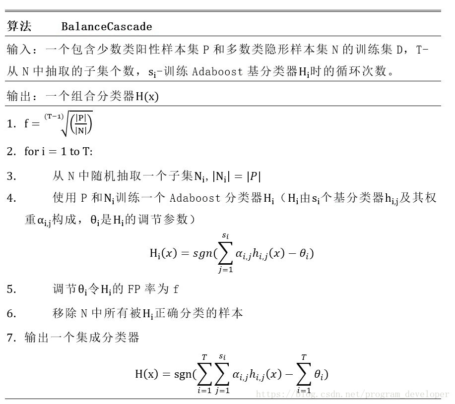
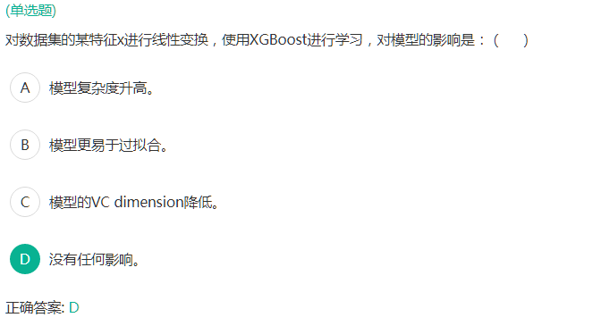

好像有一道没有记起来

## 1. 为什么归一化？常见的归一化方法。
## 2. 样本不平衡怎么解决？
   
我回答的是：通过一些方法生成量少样本
其实就是过采样

### 量多样本欠采样 undersampling
#### 1) 随机欠采样方法

缺点：
会造成一些信息缺失

#### 2) EasyEnsemble算法
##### 算法步骤：
1. 从多数类中有放回的随机采样n次，每次选取与少数类数目相近的样本个数，那么可以得到n个样本集合记作。
$$
\{S_{1maj},S_{2maj},\cdots,S_{nmaj}\}
$$
2. 然后，将每一个多数类样本的子集与少数类样本合并并训练出一个模型，可以得到n个模型。

3. 最终将这些模型组合形成一个集成学习系统，最终的模型结果是这n个模型的平均值。

#### 3) BalanceCascade算法
BalanceCascade算法基于Adaboost，将Adaboost作为基分类器，其核心思路是：

1. 在每一轮训练时都使用多数类与少数类数量相等的训练集，训练出一个Adaboost基分类器。
2. 然后使用该分类器对全体多数类进行预测，通过控制分类阈值来控制假正例率（False Positive Rate）,将所有判断正确的类删除。
3. 最后，进入下一轮迭代中，继续降低多数类数量。

### 量少样本过采样 oversampling
#### 1) 随机过采样方法

直接复制量少样本

缺点：
对于随机过采样，由于需要对少数类样本进行复制来扩大数据集，造成模型训练复杂度加大。另一方面也容易造成模型的过拟合问题，因为随机过采样是简单的对初始样本进行复制采样，这就使得学习器学得的规则过于具体化，不利于学习器的泛化性能，造成过拟合问题。

#### 2) SMOTE算法
SMOTE全称是Synthetic Minority Oversampling即合成少数类过采样技术。SMOTE算法是对随机过采样方法的一个改进算法，由于随机过采样方法是直接对少数类进行重采用，会使训练集中有很多重复的样本，容易造成产生的模型过拟合问题。而SOMT算法的基本思想是对每个少数类样本，从它的最近邻中随机选择一个样本 （ 是少数类中的一个样本），然后在  和 之间的连线上随机选择一点作为新合成的少数类样本。

SMOTE算法合成新少数类样本的算法描述如下：

#### 3) Borderline-SMOTE算法

1. 对于少数类中的每一个样本，以欧氏距离为标准计算它到少数类样本集中所有样本的距离，得到其k近邻。
2. 根据样本不平衡比例设置一个采样比例以确定采样倍率N，对于每一个少数类样本，从其k近邻中随机选择若干个样本，假设选择的是 。
3. 对于每一个随机选出来的近邻，分别与按照如下公式构建新的样本。

我们用图文表达的方式，再来描述一下SMOTE算法。

1).先随机选定一个少数类样本 。

### 阈值移动 threashold moving

## 3. 什么是欠拟合和过拟合？怎么解决？
我回答的不好，说模型过于简单是欠拟合，模型过于复杂是过拟合。

欠拟合：训练得分不高
过拟合：训练得分较高，测试得分不高（测试和训练有较大差距）
## 4. 特征选择有哪些方法？
## 5. 决策树搜索的启发式算法有哪些？
## 6. KNN与K-means的区别
## 7. SVM与LR的异同
## 8. 集成学习有哪些？
## 9. 少量样本怎么训练神经网络？
dropout
## 10. 神经网络优化器有哪些？
Adgard
RMSprop
Adam

## 11. 残差网络是什么？
https://zhuanlan.zhihu.com/p/80226180
## 12. dropout有什么用？
## 13. 大数据组件
## 14. 快排算法实现

LGB+LR训练模型 过拟合
三月数据 Data_## 3.划分为训练数据和测试数据：Data_## 3.train(## 3.## 0.) Data_## 3.test(## 3.## 0.)
LGB特征编码→LR模型训练
训练数据的F## 1.到1
测试数据的F## 1.到## 0.## 9.
但是如果用四月数据Data_## 4.## 2.## 0.)来验证：F## 1.值只用## 0.## 2.过拟合？）
怎么回事？我猜是## 3.和## 4.数据分布不同？

集成学习
Boosting
    LGB
    GBDT
    XGBoost
    Stacking+K-折交叉验证

Bagging
    RF 随机森林

特征工程（数据预处理，特征选择，特征变换）

特征变换有哪些方法？
偏态分布→正态分布
Log变换、幂次变换 (Box-Cox)
什么情况需要特征变换？
XGBoost如果进行特征变换，对结果有影响吗？（我回答的是有，面试官说没有）

大数据技能（Hadoop、Zookeeper、HBase、Hive）

数据挖掘（异常检测、计算广告、推荐系统）的岗位比NLP和图像处理更多