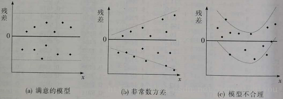
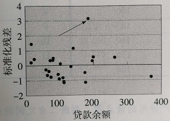
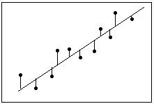
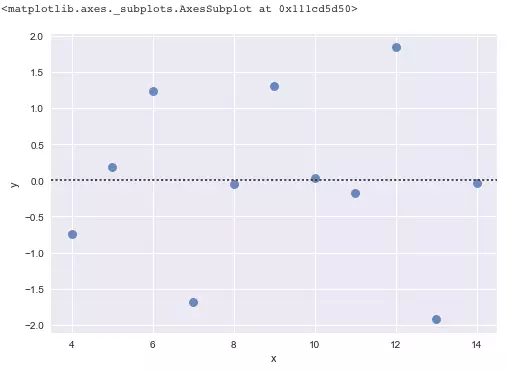
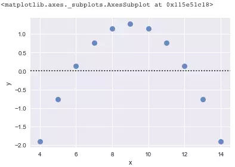

## 残差分析(残差原理与标准化残差分析)
**为什么要残差分析?**

在回归分析中,**测定值**与**按回归方程预测的值**之差,以 $\epsilon$ 表示.残差 $\epsilon$ 遵从正态分布 $N(0,\sigma^2)$. $\epsilon$ 与 $\sigma$ 之比,称为标准化残差,以 $\epsilon^\star$ 表示. $\epsilon^\star$ 遵从标准正态分布 $N(0,1)$.实验点的标准化残差落在(-2,2)区间以外的概率≤0.05.若某一度实验点的标准化残差落在(-2,2)区间以外,可在95％置信度将专其判为**异常实验点**,不参与回归线拟合.
所谓残差是指**实际观察值**与**回归估计值**的差.
显然,有多少对数据,就有多少个残差.残差分析就是通过残差所提供的信息,分析出数据的可靠性,周期性或其它干扰.

### 1,残差分析定义
在回归模型 $y=\beta_0+\beta_1x+\epsilon$ 中,假设 $\epsilon$ 的**期望为0**,**方差相等**且服从**正态分布**的一个随机变量.但是,若关于 $\epsilon$ 的<font color=red>假设不成立</font>,此时所做的**检验**以及**估计**和**预测**也许站不住脚.**确定有关的假设是否成立**的方法之一是进行**残差分析(residual analysis)**.

### 2,残差与残差图
残差(residual)是因变量的观测值 $y_i$ 与根据估计的回归方程求出的预测 $\hat{y}_i$ 之差,用$\epsilon$表示.反映了用估计的回归方程去预测而引起的误差.第$i$个观察值的残差为:$\epsilon_i=y_i-\hat{y}_i$ 

常用残差图:
1. 有关$x$残差图
2. 有关$\hat{y}$的残差图
3. 标准化残差图

有关$x$残差图:用横轴表示自变量$x$的值,纵轴表示对应残差 ,每个$x$的值与对应的残差用图上的一个点来表示.

分析残差图,首先考察残差图的形态及其反映的信息.


分析:
1. 对所有$x$值,$\epsilon$的方差都相同,且描述变量$x$和$y$之间的回归模型是合理的,残差图中的所有点落在一条水平带中间.
2. 对所有的值,$\epsilon$的方差是不同的,对于较大的$x$值,相应的残差也较大,违背了$\epsilon$的方差相等的假设.
3. 表明所选的回归模型不合理,应考虑曲线回归或多元回归模型.

### 3,标准化残差
对于$\epsilon$正态性假设的检验,也可通过标准化残差分析完成.

标准化残差(standardized residual)是残差除以其标准差后得到的数值,也称**Pearson残差**或**半学生化残差(semi-studentized residuals)**,用$Z_e$表示.第i个观察值的标准化残差为:
$$
    Z_{e_i}=\frac{e_i}{s_e}=\frac{y_i-\hat{y_i}}{s_e}
$$
($s_e$是残差的标准差的估计)

如果误差项$\epsilon$服从正态分布的这一假设成立,则标准化残差的分布也服从正态分布.大约有95%的标准化残差在 **(-2,2)** 之间.

从图中可以看出,除了箭头所标识的点外,所有的标准化残差都在 (-2,2) 之间,所以误差项服从正态分布的假设成立.

### 为啥一定要用残差图检查你的回归分析?

先说残差图究竟是什么.

<center>Residual Illustration</center>
残差图是指以残差为纵坐标,以任何其他指定的量为横坐标的散点图.(上图仅是残差的示意图,非残差图,残差图可见下文)

用普通最小二乘法(OLS)做回归分析的人都知道,回归分析后的结果一定要用**残差图(residual plots)**来检查,以验证你的模型.你有没有想过这究竟是为什么?残差图又究竟是怎么看的呢?

这背后当然有数学上的原因,但是这里将着重于聊聊概念上的理解.从根本上说,**随机性(randomness)和不可预测性(unpredictability)是任何回归模型的关键组成部分**,如果你没有考虑到这两点,那么你的模型就不可信了,甚至说是无效的.

为什么这么说呢?首先,对于一个有效的回归模型来说,可以细分定义出两个基本组成部分:

Response =(Constant + Predictors)+ Error

我想说的是另一种说法,那就是:

**响应(Response) = 确定性(Deterministic) + 随机性(Stochastic)**

(有时候真是不得不吐槽下,毕竟是外国人发明的现代科学,中文翻译过来难眠有混淆视听之嫌,学术词汇的理解还是看英文更能清晰本质,一会就会聊到Stochastic就明白为什么这么说)

#### 确定性部分(The Deterministic Portion)
为了完整,先提一下Deterministic这部分.在预测模型中,该部分是由关于预测自变量的函数组成,其中包含了**回归模型中所有可解释,可预测的信息**.

#### 随机误差(The Stochastic Error)
Stochastic 这个词很牛逼,其不仅蕴含着随机性(random),还有**不可预测性(unpredictable)**.这是很重要的两点,往往很多朋友都以为有随机性的特点就够了,其实不然.这两点放在一起,就是在告诉我们回归模型下的**预测值和观测值之间的差异必须是随机不可预测的**.换句话说,**在误差(error)中不应该含有任何可解释,可预测的信息**.

模型中的确定性部分应该是可以很好的解释或预测任何现实世界中固有的随机响应.如果你在随机误差中发现有可解释的,可预测的信息,那就说明你的预测模型缺少了些可预测信息.那么残差图(residual plots)就可以帮助你检查是否如此了!

小注:回归残差其实是真实误差(ture error)的估计,就好比回归系数是真实母体系数(ture population coefficients)的估计.

#### 残差图(Residual Plots)
我们可以用残差图来估计观察或预测到的误差error(残差residuals)与随机误差(stochastic error)是否一致.用一个丢骰子的例子最好理解了.当你丢出去一个六面的骰子时,你不应该能够预测得到哪面点数向上.然而,你却可以评估在一系列投掷后,正面向上的数字是否遵循一个随机模式,你自己心中就会想象出一个随机散布的残差图.如果,有人背着你对骰子做了点手脚,让六点更频繁的出现向上,这时你心中的残差图看上去就似乎有规律可循,从而不得不修改心中的模型,让你狐疑骰子一定有问题.

相同的原则也适用于回归模型.你不应该能够预测任何给定的观察或预测结果的错误(或者说差别).你需要确定残差是否与随机误差相互呈现一致性,就像丢骰子一样,残差若整体呈现"很古怪”的模式,你就需要回头修改你的回归模型了.上面"古怪”究竟怎么看呢?看下文.

话说,OLS回归模型的随机误差到底是什么样子的呢?首先,残差不应该成片的很高或很低,而是在拟合值的范围内,残差应该以0为中心.换句话说,模型的拟合应该平均散布在被拟合值点附近.而且,在OLS理论中,假设随机误差产生的是正态分布的残差.因此,残差应该是以对称的模式,并且在整个拟合范围内具有恒定均匀的扩散,如下图python代码和绘图:
``` python
%matplotlib inline
import numpy as np
import matplotlib as mpl
import matplotlib.pyplot as plt
# 给任务单独分配随机种子
np.random.seed(sum(map(ord
                       , "anscombe"))) 
import seaborn as sns

anscombe = sns.load_dataset("anscombe")
sns.residplot(x="x", y="y"
              , data=anscombe.query("dataset == 'I'")
              , scatter_kws={"s": 80}) 
```

<center>Valid residual plot</center>
这是用Seaborn画的美图.拟合的好,就是0均值的白噪声分布 $N(0,\sigma^2)$,不含任何人为模态.

下面来看一个有问题的残差图.请一定要记住,残差不应该包含任何可预测的信息.
``` python
sns.residplot(x="x", y="y"
              , data=anscombe.query("dataset == 'II'")
              , scatter_kws={"s": 80})
```

<center>Not valid residual plot</center>
在上图中,你就可以根据拟合值来预测残差的非零值.例如,拟合值为9的预期残差为正值,而5和13的拟合值具有负的预期残差.

残差中的非随机模式表明模型的确定部分(预测变量)没有捕获一些"泄露”到残差中的一些可解释／可预测信息.该图表明模型几种没法解释的可能性,可能性包括:

* 一个缺失的变量
* 模型缺少一个变量的高阶项来解释曲率
* 模型缺少在已经存在的项之间的相互作用项(交叉项)
  
由此来回溯去修改模型,以期望修改后的残差图是理想中的残差图.

除了上述之外,还有两种预测信息会潜入到了残差中的方式:

* 残差不应该与另外的变量有所相关.如果你可以用另一个变量预测出此残差图,那么该变量就应该考虑到你的模型当中.那么就可以通过绘制其他变量的残差图,来考察这个问题.
* 相邻残差(Adjacent residuals)不应该相互关联(残差的自相关性).如果你可以使用一个残差来预测得到下一个残差,则说明存在一些模型还未捕捉到的可预测信息.通常来说,这种情况涉及时间有序的观察预测.例子就不举了.
综上,若非要一句话小结,那就是要留意两个细节:正确残差图不仅要体现出**随机性(random)**,还要体现**不可预测性(unpredictable)**即可.

以上.

**参考:**

[残差分析(残差原理与标准化残差分析)](https://blog.csdn.net/mengjizhiyou/article/details/82216278)  

[残差分析-百度百科](https://baike.baidu.com/item/%E6%AE%8B%E5%B7%AE%E5%88%86%E6%9E%90)  

[为啥一定要用残差图检查你的回归分析?](https://www.jianshu.com/p/c9022affd8b9)  

[Regression Analysis Tutorial and Examples](https://link.jianshu.com/?t=http://blog.minitab.com/blog/adventures-in-statistics-2/regression-analysis-tutorial-and-examples)  

[Why You Need to Check Your Residual Plots for Regression Analysis: Or, To Err is Human, To Err Randomly is Statistically Divine](https://link.jianshu.com/?t=http://blog.minitab.com/blog/adventures-in-statistics-2/why-you-need-to-check-your-residual-plots-for-regression-analysis)  
