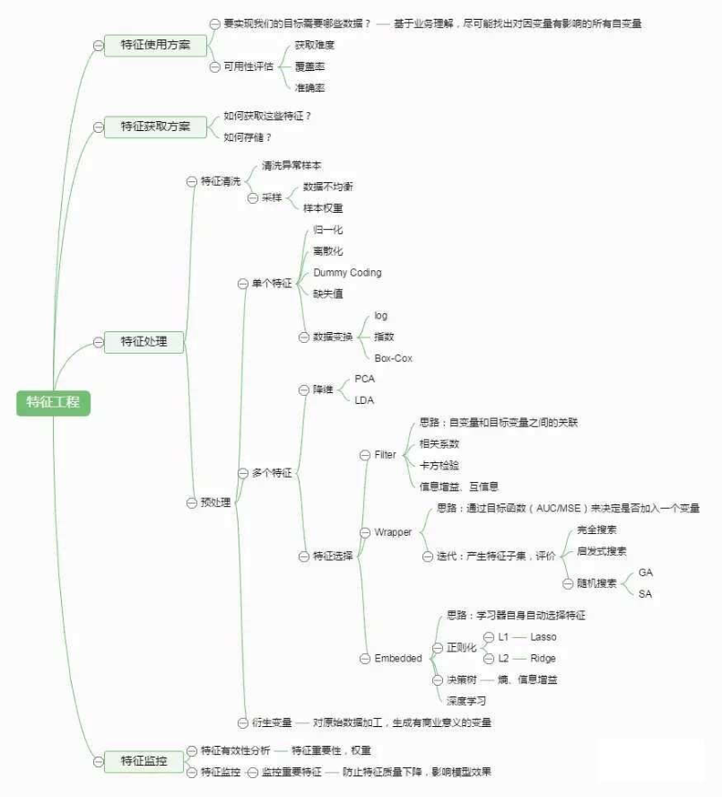

## 第2章:第一个机器学习实例
课程网址: http://edu.csdn.net/huiyiCourse/detail/538

### 学习要点
1. 学习环境配置:常用软件,环境配置及机器学习库;anaconda:Python,Python科学计算包(NumPy,SciPy,Pandas),Python数据可视化工具包(Matplotlib, seaborn),Python机器学习库(scikit-learn),示例代码(INotebook); 
2. 特征工程初步; 
3. 线性回归实现. 
4. 案例:波士顿房价预测案例详解.包含内容——数据集探索(Pandas,seaborn);复习模型评估和模型选择:交叉验证,网格搜索(Sklearn). 
5. 课程目标:学会用机器学习工具包从头到尾用线性回归解决一个实际问题.
### 工具介绍    
Anaconda  
Jupyter Notebook 原来叫INotebook,Ipython解释器和浏览器接口的Notebook  
Numpy 矩阵 矩阵运算 傅里叶...10^6级别数据  
SciPy建立在Numpy上,10^10级别数据或者稀疏数据用Scipy的矩阵表示 import scipy.sparse  
Pandas(Panel data structures)"关系数据库”数据结构和数据分析工具,基于NumPy补充了大量数据操作功能(统计,分组,排序,透视表 SQL大部分功能) Series DataFrame  
Matplotlib 2D图形库(比较复杂)  
Seaborn基于Matplotlib的可视化工具包,提供更高层次的用户接口(比较方便,是对Matplotlib的封装)  
Scikit-Learn 基于Python的开原机器学习模块  
六部分功能:
1. 分类(Classification)
2. 回归(Regression)
3. 聚类(Clustering)
4. 数据降维(Dimensionality reduction)
5. 模型选择(Model Selection)
6. 数据与处理(Preprocessing)

对于具体的机器学习任务,通常分为三个步骤
1. 数据准备和预处理(Preprocessing,Dimensionality reduction)
2. 模型选择和训练(Classification,Regression, Clustering)
3. 模型验证和参数调优(Model Selection)

### 机器学习模型选择


通用概念SVM,SVC,SVR  
kernel=  
liner – 线性核函数:$u'v$
poly – 多项式核函数:$(\gamma u'v + c)^{degree}$  
rbf – RBF高斯核函数:$exp(-\gamma||u-v||^2)$(Gauss)Radial Based Function核 (高斯)径向基函数核

kernel approximation:核渐进 核近似 核估计 具体什么意思不清楚,资料很少

SGD: 随机梯度下降

Ensemble:集成(学习)
### Classification:分类
SVC:SVM的分类
### Clustering:聚类
KMeans:K均值  
Spectral Clustering:谱聚类  
GMM:混合高斯模型(可用于聚类,明白它相较于Kmeans的优缺点)  
MeanShift:均值偏移(mean shift,也叫均值漂移或均值平移) 关于概率密度梯度函数的估计 它是一种无参估计算法,沿着概率梯度的上升方向寻找分布的峰值  一种非参数的统计迭代算法  
VBGMM:不知道是什么,GMM的一种?  
MiniBatch:是一个一次训练数据集的一小部分,而不是整个训练集的技术(大样本时,每次训练一小部分)
### Regression:回归
RidgeRegression:岭回归  
ElasticNet:弹性网络  
SVR:SVM的回归
### Dimensionality reduction:降维
randomized PCA :randomized一般适用于数据量大,数据维度多同时主成分数目比例又较低的PCA降维,它使用了一些加快SVD的随机算法  
MDS:(Multiple Dimensional Scaling)多维缩放(西瓜书227页)  
Isomap:(Isometric Feature Mapping)等度量映射(西瓜书 234页)  
[Spectral Embedding:谱嵌入(资料很少啊  Nie等人2011年提出谱嵌入聚类,高维数据的类别标签矩阵总是可以嵌入到一个线性空间中去)](https://www.researchgate.net/publication/51686544_Spectral_Embedded_Clustering_A_Framework_for_In-Sample_and_Out-of-Sample_Spectral_Clustering)  
LLE:局部线性嵌入(西瓜书 235页)

Lasso(L1正则)核ElasticNet(L1+L2正则)可以用来选择重要的特征  
RidgeRegression(L2正则)
### sk-learn的优点
统一接口,几乎相同的机器学习步骤  
默认参数,一些方法参数很多的(学到后期能够知道各个参数的功能,调参数)  
丰富文档 学完文档就基本学完了机器学习(80%)  
丰富样例 照葫芦画瓢学习  
活跃社区
### 机器学习实例
这节课主要是确定特征(可能也是机器学习中最重要的步骤)



<font color=red>途中的特征选择→Embeded→正则化中的L2正则不能用于特征选择,L1可以.</font>

#### 读取数据
从Pandas读取,支持多种格式的数据  
SQL,Excel  
时间序列(有序或者无序(不一定是固定频率))  
矩阵数据  
其他形式的数据集  
例如:csv,json,html,clipboard,excel,sql,等等  
自带的数据集(boston,iris等)  
#### 数据探索&特征工程
数据规模  
特征编码(以后讲解)  
缺失值,数据补填  
数据分布,异常点处理  
特征两两之间的关系,看是否有冗余/相关,降维
#### 数据预览
pandas读取到的数据类型是 DataFrame  
    Head():头五行  
    Info():数据规模:行数&列数  每列数据类型,是否有空值  占用存储量  
    shape:行数&列数
#### 数据预处理  
from sklearn.preprocessing import ...  
##### <font color=red>标准化(Standardization)</font>:  
z-score(zero-mean normalization)  
特征样本取值为 0均值,1方差  
对每维特征单独处理:  
$$
    \begin{aligned}
        &x'_i=\frac{x_i-\mu}{\sigma}\\
        &where\ \mu=\frac{1}{N}\sum_{i=1}^Nx_i,\sigma=\frac{1}{?}\sum_{i=1}^N(x_i-\mu)^2
    \end{aligned}
$$
TODO:<font color=red>这里用的标准差是 **总体标准差** $\sigma=\frac{1}{N}\sum_{i=1}^N(x_i-\mu)^2$ 还是 **样本标准差** $\sigma=\frac{1}{N-1}\sum_{i=1}^N(x_i-\mu)^2$</font>  

使用类**StandardScaler**  

##### <font color=red>归一化(Scaling)</font>:
特征样本取值在规定范围内(线性缩放)       
使用类MinMaxScaler →[0,1]或者使用类MaxAbsScaler→[-1,1]  
对非常小的标准偏差的特征鲁棒性更强,在稀疏数据中保留零条目(min=0,经过变换后还是0)  

##### <font color=red>正规化(Normalization)</font>:
每个样本模长为1  
使用类Normalizer  
用于求欧式距离(相似度度量指标),SVM核方法两向量点积,或者其他内核的二次型来量化任何样本的相似度,例如文本分类和聚类 使用的向量空间模型  
##### <font color=red>二值化(Binary):</font>
特征值根据阈值设置成0或1  
数据缺失  
使用类Imputer  
均值mean(默认)    
中位数median    
众数most_frequent  
数据类型变换(以后讲解) 转成数值类型  

TOOD: 还有其他的处理方法,比如 离散化,函数变换等 可以参考  
[数据标准化/归一化normalization](https://blog.csdn.net/pipisorry/article/details/52247379)

#### 数据分布  
data.describe()    pandas中提供describe()  
    count mean std min 25% 50% 75% max  
直方图 更加细致和直观  
    可以看做概率函数(PDF)的估计  
    使用seaborn  
  
sb.distplot    连续型  
  
sb.countplot    离散型  
离群点 或者叫奇异点(outlier)  
    直方图尾巴  
    离散点中孤立点
#### 相关性
线性相关 与独立的区别
相关系数公式$\frac{Cov(x,y)}{\sqrt{D(x)}\sqrt{D(y)}}$
希望特征与标签强相关  
特征之间强相关意味着存在冗余  
    可以两个特征只保留一个  
    PCA等降维  
相关系数矩阵(与协方差矩阵有什么不同?)查看所有特征之间相关系数  
散点图 直观感受两个特征之间的相关性
#### 最小二乘线性回归  
目标函数:残差平方和(residual sum of squares rss)  L2损失    最小二乘法的损失函数 等价于 残差独立同分布(同一个正态分布)的极大似然估计    残差基本满足均值为0的正态分布
#### 波士顿房价问题
在对模型进行预测时,如使用sklearn中的KNN模型,
``` python
import numpy as np
from sklearn.neighbors import StandardScaler
y = [50000,8,1.2]
ss=StandardScaler()
y = ss.fit_transform(y)
```
会报错
>ValueError: Expected 2D array, got 1D array instead:
>Reshape your data either using array.reshape(-1, 1) if your data has a single feature or array.reshape(1, -1) if it contains a single sample.

这是由于在新版的sklearn中,所有的数据都应该是二维矩阵,哪怕它只是单独一行或一列(比如前面做预测时,仅仅只用了一个样本数据),所以需要使用.reshape(1,-1)进行转换,具体操作如下.需改为
``` python
y = ss.fit_transform(np.array(y).reshape(1, -1))
```
#### 线性回归 随机梯度下降优化的线性回归 正则化的线性回归
##### LinearRegression  
线性回归模型  
目标函数
$$J(\boldsymbol{w})=\sum_i(y_i-\boldsymbol{w^T}\boldsymbol{x_i})$$
最小化目标函数
$$\argmin_{\boldsymbol{w}}J(\boldsymbol{w})$$
解得
$$\boldsymbol{w}=(\boldsymbol{X^TX})^{-1}\boldsymbol{X^Ty}$$
y和x是标准化的 没有w0截距项
SGDRegressor  随机梯度下降    
一般来说 SGD的score没有线性模型的高,但当数据量大时,SGD的性能会好很多,sklearn建议样本数超过10万采用SGDRegressor
##### RidgeCV
岭回归(Ridge)就是在线性模型的基础上加了L2正则  
当数据中有共线性因素时,OLS(最小二乘)是不稳定的 岭回归克服特征共线性问题  
目标函数
$$J(\boldsymbol{w})=\sum_i(y_i-\boldsymbol{w^T}\boldsymbol{x_i})+\lambda||\boldsymbol{w}||^2$$
既要损失小,又要系数绝对值小
y和x是标准化的 没有w0截距项
最小化目标函数
$$\argmin_{\boldsymbol{w}}J(\boldsymbol{w})$$
解得
$$\boldsymbol{w}=(\boldsymbol{X^TX}+\lambda\boldsymbol{I}_d)^{-1}\boldsymbol{X^Ty}$$
$\lambda=0$时就是最小二乘   
$\lambda→\infty$时解得$\boldsymbol{w}=\boldsymbol{0}$.如果没有对数据做标准化,只有$w_0$ 截距项(均值),其他系数都为零,就是用均值来模拟数据.  
如何找到一个合适的λ?使用交叉验证  
RidgeCV已经封装了(N折留一交叉验证),直接使用就行  
``` python
RidgeCV(alphas=array([1.e-02, 1.e-01, 1.e+00, 1.e+01, 2.e+01, 4.e+01, 8.e+01, 1.e+02]),# λ参数
cv=None, # 交叉验证模式 与gcv_model取一个就可以  
fit_intercept=True, # 是否对截距项拟合  
gcv_mode=None, # 留一交叉验证 与cv取一个就可以  
normalize=False, # 标准化
scoring=None, # 评价标准 默认是均方误差  
store_cv_values=True # 是否保留cv值
)

# 实例
reg = RidgeCV(alphas,store_cv_values=True)
reg.fit(X,y)
```
会计算所有$\alpha$并保留最佳$\alpha$的值(还有cv_values)  
  
##### LassoCV 
Lasso就是在线性模型的基础上加了L1正则  
**least absolute shrinkage and selection operator** 可以起到特征选择(有些系数为0)不好优化,坐标下降  还有一种LARS(least angle regression,最小角回归,区别于坐标下降)  
目标函数
$$J(\boldsymbol{w})=\sum_i(y_i-\boldsymbol{w^T}\boldsymbol{x_i})+\lambda||\boldsymbol{w}||$$

##### 几种回归比较
岭回归使用的是L2正则,得到的结果:系数会收缩.  
Lasso使用的是L1正则,结果会:小的更小(有些会缩到0),大的更大.

一般先用线性模型,作为一个baseline,看r2score高不高,不行再用非线性模型.  
不是线性模型需满足正态分布,而是其残差满足正态分布

岭回归是需要标准化的.因为岭回归是在最小二乘的基础上加一个惩罚项,通过惩罚项来限制参数的大小.所以参数的量纲会影响惩罚项的大小,所以需要标准化.  

jupter notebook  
esc和enter  
up和down  

numpy  
10^6级别数据  
ndarray n维数组  
随机数产生器  
傅里叶变换  

scipy 建立在numpy上的科学计算包    10^10级别或者稀疏矩阵  
import scipy.sparse  

pandas 建立在numpy上的关系数据库  

seaborn 
http://seaborn.pydata.org/index.html  
https://www.zhihu.com/collection/170666882  

特征工程 原始特征→生成新特征  

最小二乘线性回归 等价于 极大似然估计  

随机梯度下降  

$R^2score$ 
