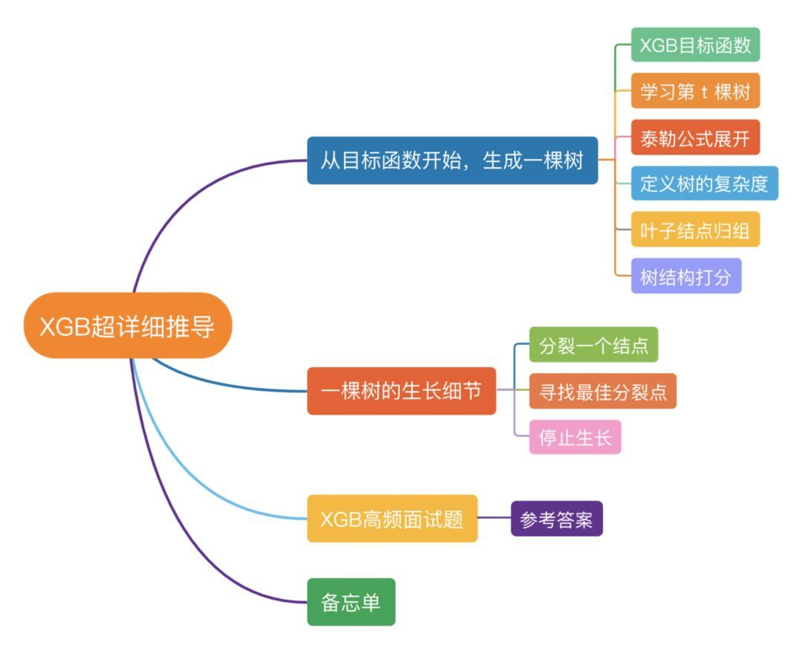
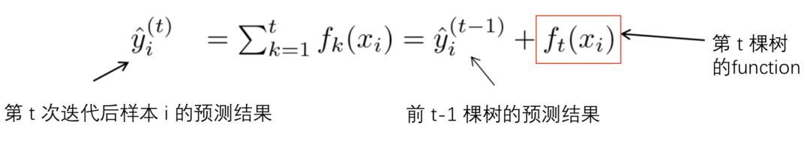
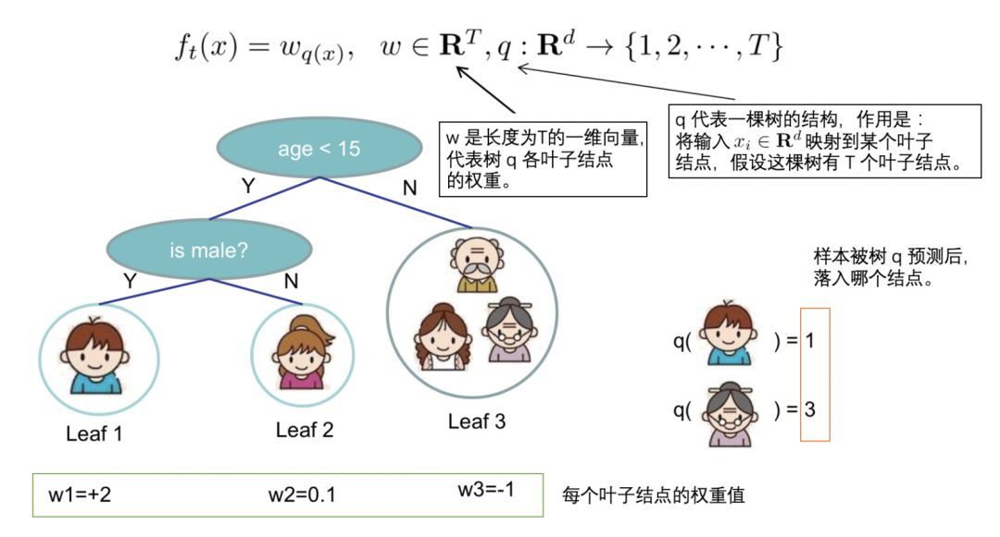

## XGBoost推导

* XGB中树节点分裂的依据是什么?
* 如何计算树节点的权值?
* 为防止过拟合,XGB做了哪些改进?

相信看到这篇文章的各位对XGBoost都不陌生,的确,XGBoost不仅是各大数据科学比赛的必杀武器,在实际工作中,XGBoost也在被各大公司广泛地使用.

如今算法岗竞争日益激烈,面试难度之大各位有目共睹,面试前背过几个常见面试题已经远远不够了,面试官通常会"刨根问底",重点考察候选人对模型的掌握深度.因此,对于XGBoost,你不仅需要知其然,而且还要知其所以然.

本文重点介绍XGBoost的推导过程,文末会抛出10道面试题考验一下各位,最后准备了一份"XGB推导攻略图”,帮助你更好的掌握整个推导过程.

### 00 本文结构

### 01 从"目标函数”开始,生成一棵树

#### 【1】XGB目标函数
XGBoost的目标函数由训练损失和正则化项两部分组成,目标函数定义如下:

变量解释:

(1)$l$ 代表损失函数,常见的损失函数有:

逻辑回归损失函数的其他表达形式:
$$
    \begin{aligned}
        l(y_i,\hat{y}_i)&=y_i\ln(1+e^{-\hat{y}_i})+(1-y_i)\ln(1+e^{\hat{y}_i})\\
        &= \ln(1+e^{\hat{y}_i})+y_i\ln(\frac{1+e^{-\hat{y}_i}}{1+e^{\hat{y}_i}})\\
        &=\ln(1+e^{\hat{y}_i})-y_i\hat{y}_i\\
        &=\ln(1+e^{\boldsymbol{w}^T\boldsymbol{x_i}})-y_i\boldsymbol{w}^T\boldsymbol{x_i}
    \end{aligned}
$$

(2)$\hat{y}_i$ 是第 $i$ 个样本 $x_i$ 的预测值.由于XGBoost是一个**加法模型**,因此,预测得分是每棵树打分的累加之和.

(3)将全部 $K$ 棵树的复杂度进行求和,添加到目标函数中作为正则化项,用于防止模型过度拟合.
$$
    \sum_{k=1}^K\Omega(f_k)
$$

#### 【2】学习第t棵树
在【1】中提到,XGBoost 是一个加法模型,假设我们第t次迭代要训练的**树模型**是 $f_t(x)$ ,则有:

树模型$f_t(x)$ 是什么?具体是什么形式?

将上式带入【1】中的目标函数 $Obj$ ,可以得到:

注意上式中,**只有一个变量**,那就是第 $t$ 棵树:
$$
    f_t(x_i)
$$
其余的都是已知量或可通过已知量可以计算出来的(注意要理解哦!).

细心的同学可以发现,这里我们将正则化项进行了拆分,由于**前 t-1 棵树的结构已经确定**,因此,**前 t-1 棵树的复杂度之和可以用一个常量表示**:

#### 【3】泰勒公式展开
首先简单回忆一下,泰勒公式.

泰勒公式是将一个在 $x = x_0$ 处具有n阶导数的函数 $f(x)$ 利用关于 $(x-x_0)$ 的n次多项式来逼近函数的方法.

泰勒公式的二阶展开形式如下:
$$
    f(x+\Delta x)\simeq f(x) + f'(x)\Delta x + \frac{1}{2}f''(x)\Delta x^2
$$
回到我们的问题上来,$f(x)$ 对应于我们的损失函数 $l$ ,$x$ 对应于前 $t-1$ 棵树的预测值,$\Delta x$ 对应于我们正在训练的第 $t$ 棵树.

首先定义损失函数 $l$ 关于 $\hat{y}^{(t-1)}$ 的一阶偏导数和二阶偏导数:
$$
    g_i=\partial_{\hat{y}^{(t-1)}}l(y_i,\hat{y}^{(t-1)}),\quad
    h_i=\partial_{\hat{y}^{(t-1)}}^2l(y_i,\hat{y}^{(t-1)})
$$
那么,我们的损失函数就可以转化为下式(标出了与泰勒公式中 $x$ 和 $\Delta x$ 的对应关系).

为什么前 $t-1$ 棵树带来的损失 $l(y_i,\hat{y}_i^{(t-1)})$ 是常量. 

$$
    Obj^{(t)}\simeq\sum_{i=1}^n\left[l(y_i,\hat{y}_i^{(t-1)})+g_if_t(x_i)+\frac{1}{2}h_if_t^2(x_i)\right]+\Omega(f_t)+constant
$$

将上述二阶展开式,带入到【2】中的目标函数 $Obj$ 中,可以得到目标函数 $Obj$ 的近似值:

**去掉全部常数项**,得到目标函数:

#### 【4】定义一颗树

我们重新定义一颗树,包括两个部分:
* 叶子结点的权重向量 $w$ ;
* 实例 $\rightarrow$ 叶子结点 的映射关系 $q$(本质是树的分支结构);
  
一棵树的表达形式定义如下:

#### 【5】定义树的复杂度

我们定义一颗树的复杂度 $\Omega$,它由两部分组成:
* 叶子结点的数量;
* 叶子结点权重向量的L2范数;怎么理解权重向量的L2范数

#### 【6】叶子结点归组

我们将属于第 j 个叶子结点的所有样本 xi , 划入到一个叶子结点样本集中,数学表示如下:

然后,将【4】和【5】中一棵树及其复杂度的定义,带入到【3】中泰勒展开后的目标函数Obj中,具体推导如下:

为进一步简化该式,我们进行如下定义:

含义如下:
* $G_j$ :叶子结点 j 所包含样本的`一阶偏导数`累加之和,是一个常量;
* $H_j$ :叶子结点 j 所包含样本的`二阶偏导数`累加之和,是一个常量;

将 $G_j$ 和 $H_j$ 带入目标式Obj,得到我们**最终的目标函数**(注意,此时式中的变量只剩下第t棵树的权重向量W):

#### 【7】树结构打分
回忆一下高中数学知识.假设有一个一元二次函数,形式如下:

我们可以套用一元二次函数的**最值公式**轻易地求出最值点:

那回到我们的目标函数 Obj,该如何求出它的最值呢?

先简单分析一下上面的式子:

对于每个叶子结点 j , 可以将其从目标式 Obj 中拆解出来:

在【6】中我们提到,$G_j$ 和 $H_j$ 相对于第 $t$ 棵树来说是可以计算出来的.那么,这个式子就是一个只包含一个变量 **叶子结点权重$w_j$** 的一元二次函数,上面也提到了,我们可以通过最值公式求出它的最值点.

再次分析一下目标函数Obj,可以发现,各个叶子结点的目标子式是相互独立的,也就是说,当每个叶子结点的子式都达到最值点时,整个目标函数式Obj才达到最值点.

那么,假设目前树的结构已经固定,套用一元二次函数的**最值公式**,我们可以轻易求出,每个叶子结点的权重 $w_j^*$ 及其此时达到最优的 Obj 的目标值:

#### 【8】实例演示: 

### 02 一棵树的生长细节

#### 【1】分裂一个结点
在实际训练过程中,当建立第 t 棵树时,XGBoost采用贪心法进行树结点的分裂:
* 从树深为0时开始:
* 对树中的每个叶子结点尝试进行分裂;
* 每次分裂后,原来的一个叶子结点继续分裂为左右两个子叶子结点,原叶子结点中的样本集将根据该结点的判断规则分散到左右两个叶子结点中;
* 新分裂一个结点后,我们需要检测这次分裂是否会给损失函数带来增益,增益的定义如下:

如果增益Gain>0,即分裂为两个叶子节点后,目标函数下降了,那么我们会考虑此次分裂的结果.

但是,在一个结点分裂时,可能有很多个分裂点,每个分裂点都会产生一个增益,如何才能寻找到最优的分裂点呢?接下来会讲到.

#### 【2】寻找最佳分裂点
在分裂一个结点时,我们会有很多个候选分割点,寻找最佳分割点的大致步骤如下:
* 遍历每个结点的每个特征;
* 对每个特征,按特征值大小将特征值排序;为什么排序?是单调的吗?
* 线性扫描,找出每个特征的最佳分裂特征值;
* 在所有特征中找出最好的分裂点(分裂后增益最大的特征及特征值)

上面是一种贪心的方法,每次进行分裂尝试都要遍历一遍全部候选分割点,也叫做**全局扫描法**.

但当数据量过大导致内存无法一次载入或者在分布式情况下,贪心算法的效率就会变得很低,全局扫描法不再适用.

**基于此,XGBoost提出了一系列加快寻找最佳分裂点的方案:**
* **特征预排序+缓存**:XGBoost在训练之前,预先对每个特征按照特征值大小进行排序,然后保存为block结构,后面的迭代中会重复地使用这个结构,使计算量大大减小.
* **分位点近似法**:对每个特征按照特征值排序后,采用类似分位点选取的方式,仅仅选出常数个特征值作为该特征的候选分割点,在寻找该特征的最佳分割点时,从候选分割点中选出最优的一个.
* **并行查找**:由于各个特性已预先存储为block结构,XGBoost支持利用多个线程并行地计算每个特征的最佳分割点,这不仅大大提升了结点的分裂速度,也极利于大规模训练集的适应性扩展.
  
#### 【3】停止生长
一棵树不会一直生长下去,下面是一些常见的限制条件.

1. 当新引入的一次分裂所带来的增益Gain<0时,放弃当前的分裂.这是**训练损失和模型结构复杂度的博弈过程**.

2. 当树达到最大深度时,停止建树,因为树的深度太深容易出现过拟合,这里需要设置一个超参数max_depth.
3. 当引入一次分裂后,重新计算新生成的左,右两个叶子结点的**样本权重和**.如果任一个叶子结点的样本权重低于某一个**阈值**,也会放弃此次分裂.这涉及到一个超参数:**最小样本权重和**,是指如果一个叶子节点包含的样本数量太少也会放弃分裂,防止树分的太细,这也是防止过拟合的一种措施.
每个叶子结点的样本权值和计算方式如下:为什么就是上面推导的使得目标函数极值对应的权重

### 03 高频面试题
* XGB与GBDT,随机森林等模型相比,有什么优缺点?
* XGB为什么可以并行训练?
* XGB用二阶泰勒展开的优势在哪?
* XGB为了防止过拟合,进行了哪些设计?
* XGB如何处理缺失值?
* XGB如何分裂一个结点?如何选择特征?
* XGB中一颗树停止生长的条件有哪些?
* XGB叶子结点的权重有什么含义?如何计算?
* 训练一个XGB模型,经历了哪些过程?调参步骤是什么?
* XGB如何给特征评分?

面试题-参考答案:
[珍藏版 | 20道XGBoost面试题](https://mp.weixin.qq.com/s?__biz=MzI1MzY0MzE4Mg==&mid=2247485159&idx=1&sn=d429aac8370ca5127e1e786995d4e8ec&chksm=e9d01626dea79f30043ab80652c4a859760c1ebc0d602e58e13490bf525ad7608a9610495b3d&scene=21#wechat_redirect)

04

备忘单

经过前面几个部分的细心讲解,相信大家对XGBoost底层原理已经很了解了,下面特意又准备了一份备忘单,希望能够帮助大家系统化的掌握XGB原理的整个推导过程,同时又能够起到快速回忆的作用.

