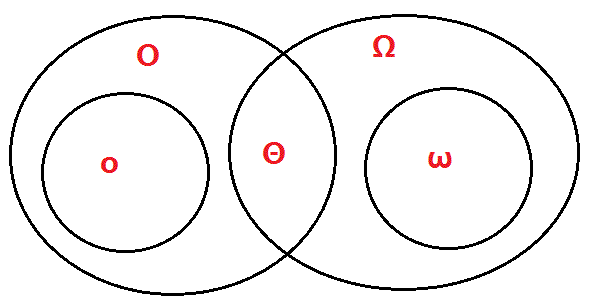

## 1.算法分析

### 1.1 渐近记号$Θ$,$Ο$,$o$,$Ω$,$ω$详解

#### 1.1.1 渐近紧确界记号: $Θ$(大-theta)
假设算法A的运行时间表达式$T_1(n)$为:$T_1(n)=30n^4+20n^3+40n^2+46n+100$
假设算法B的运行时间表达式$T_2(n)$为:$T_2(n)=1000n^3+50n^2+78n+10$
当问题规模足够大的时候,例如n=100万,算法的运行时间将主要取决于时间表达式的第一项,其它项的执行时间只有它的几十万分之一,可以忽略不计.第一项的常数系数,随着n的增大,对算法的执行时间也变得不重要了.
  于是,算法A的运行时间可以记为:$T_1(n)≈n^4$,记为$T_1(n)=Θ(n^4)$;算法B的运行时间可以记为:$T_2(n)≈n^3$,记为$T_2(n)=Θ(n^3)$.

>$Θ$的数学含义
方式一:设$f(n)$和$g(n)$是定义域为自然数集合的函数.如果 $\displaystyle\lim_{n\rightarrow ∞}\dfrac{f(n)}{g(n)}$存在,并且等于某个常数$c(c>0)$,那么$f(n)=Θ(g(n))$.通俗理解为$f(n)$和$g(n)$同阶,$Θ$用来表示算法的精确阶.
方式二:$Θ(g(n))=f(n)$:存在正常量$c_1$,$c_2$和$n_0$,使得对所有,使得对所有,使得对所有$n≥n_0$,有$0≤c_1g(n)≤f(n)≤c_2g(n)$若存在正常量$c_1$,$c_2$,使得对于足够大的$n$,函数$f(n)$能"夹入”$c_1g(n)$与$c_2g(n)$之间,则$f(n)$属于集合$Θ(g(n))$,记作$f(n)∈Θ(g(n))$.作为代替,我们通常记"$f(n)=Θ(g(n))$”.

由下图中左侧$f(n)=Θ(g(n))$图可以看出,对所有$n>n_0$时,函数$f(n)$乘一个常量因子可等于$g(n)$,我们称$g(n)$是$f(n)$的一个<strong style="color:red;">渐近紧确界</strong> .$Θ$记号在五个记号中,要求是最严格的,因为$g(n)$即可以表示上界也可以表示下界.

需要注意的是:$Θ(g(n))$的定义要求每个成员$f(n)∈Θ(g(n))$均 <strong style="color:red;">渐近非负</strong>,即当n足够大时,$f(n)$非负. <strong style="color:red;">渐近正函数</strong> 就是对所有足够大的$n$均为正的函数.

#### 1.1.2 渐近上界记号:$O$(大-oh)

>定义:设$f(n)$和$g(n)$是定义域为自然数集$N$上的函数.若存在正数$c$和$n_0$,使得对一切$n≥n_0$都有$0≤f(n)≤cg(n)$成立,则称$f(n)$的渐进的上界是$g(n)$,记作$f(n)=O(g(n))$.通俗的说n满足一定条件范围内,函数$f(n)$的阶不高于函数$g(n)$.

根据符号$O$的定义,用它评估算法的复杂度得到的只是问题规模充分大时的一个上界.这个上界的阶越低,评估越精确,越有价值.

>例如:设$f(n)=n^2+n$,则
$f(n)=O(n^2)$,取$c=2$,$n_0=1$即可
$f(n)=O(n^3)$,取$c=1$,$n_0=2$即可.显然,$O(n^2)$作为上界更为精确.

<strong style="color:red;">几种常见的复杂度关系</strong>

>$O(1)<O(\log n)<O(n)<O(n\log n)<O(n^2)<O(2^n)<O(n!)<O(n^n)$
需要注意的是:对数函数在没有底数时,默认底数为2;如$\lg n=\log n=\log_2 n$,因为计算机中很多程序是用二分法实现的.

符号用法测试:素数测试
``` c
int isprime(int n) {
    for(int i=2; i<=(int)sqrt(n); i++) {
        if(n%i==0) { 
            return 0;
        }
    }
    return 1;
}
```
在上面这个素数测试的例子中,基本运算是整除;时间复杂度$T(n)=O(n^{\frac{1}{2}})$是正确的.当被测的数$n$为偶数时,基本运算一次也没执行,所以$T(n)=Θ(n^{\frac{1}{2}})$是错误的,因为没有办法证明$T(n)$的下界是$Ω(n^{\frac{1}{2}})$.

#### 1.1.3 渐近下界记号:$Ω$(大-omege)
>定义:设$f(n)$和$g(n)$是定义域为自然数集$N$上的函数.若存在正数$c$和$n_0$,使得对一切$n≥n_0$​都有$0≤cg(n)≤f(n)$成立,则称$f(n)$的渐进的下界是$g(n)$,记作$f(n)=Ω(g(n))$.通俗的说$n$满足一定条件范围内,函数$f(n)$的阶不低于函数$g(n)$.

根据符号$Ω$的定义,用它评估算法的复杂度得到的只是问题规模充分大时的一个下界.这个下界的阶越高,评估越精确,越有价值.
>例如:设$f(n)=n^2+n$,则
$f(n)=Ω(n^2)$,取$c=1$,$n_0=1$即可
$f(n)=Ω(100n)$,取$c=1/100$,$n_0=1$即可

显然,$Ω(n^2)$作为下界更为精确.

#### 1.1.4 非渐近紧确上界:$o$(小-oh)
>定义1:设$f(n)和g(n)$是定义域为自然数集$N$上的函数.若对于任意正数$c$,都存在$n_0$,使得对一切$n≥n_0$都有$0≤f(n)$

由$O$记号提供的渐近上界可能是渐近紧确的,也可能是非紧确的.(如:$2n^2=O(n^2)$是渐近紧确的,而$2n=O(n^2)$是非紧确上界.)
>例子:$f(n)=n^2+n$,则$f(n)=o(n^3)$

#### 1.1.5 非渐近紧确下界:$ω$(小-omege)
>定义1:设$f(n)和g(n)$是定义域为自然数集$N$上的函数.若对于任意正数$c$,都存在$n_0$,使得对一切$n≥n_0$都有$0≤cg(n)$
$ω$记号与$Ω$的关系类似于$o$和$O$记号的关系.我们用$ω$表示一个非渐近紧确的下界.
>例子:$f(n)=n^2+n$,则$f(n)=ω(n)$是正确的.$f(n)=ω(n^2)$则是错误的,$f(n)=Ω(n^2)$是正确的.

#### 1.1.6 渐近记号$Θ$,$Ο$,$o$,$Ω$,$ω$的关系
|记号	|含义	|通俗理解
| ------ | ------ | ------ |
|(1)Θ(西塔)	|紧确界.	|相当于"="
|(2)O (大欧)	|上界.	|相当于"<="
|(3)o(小欧)	|非紧的上界.	|相当于"<"
|(4)Ω(大欧米伽)	|下界.	|相当于">="
|(5)ω(小欧米伽)	|非紧的下界.	|相当于">"



#### 1.1.7 参考资料
1. 算法导论  殷建平 译   机械工业出版社
2. 算法设计与分析 屈婉玲  著
3. 算法设计与分析 王秋芬  吕聪颖著

### 1.2 递归算法的时间复杂度求解
* 代换法 Substitution method
* 递归树法 Recursion-tree method
* 主方法 Master method


#### 1.2.1 算法设计与分析概述
  在总结递归算法的时间复杂度分析之前,应该明确几组概念.
  算法仅仅是求解问题的解决方案,这个解决方案本身并不是问题的答案,而是能获得答案的指令序列.只有通过执行算法才可以获得求解问题的答案.
  从算法是否递归调用的角度看,算法可以分为非递归算法和递归算法.
  非递归算法时间复杂度分析较为简单,通常是计算算法中基本语句执行次数,一般都是一个关于问题规模n的表达式,然后用渐近符号$Θ$,$O$,$o$,$Ω$,$ω$表示出算法的时间复杂度.
  递归算法是采用分治的方法,把一个"大问题”分解出若干个相似的"小问题”求解.在分析算法复杂度时,关键是根据递归过程建立递推关系式,然后求解递推关系式,得到算法执行的时间表达式(一般都与问题规模n相关),最后用渐近符号$Θ$,$O$,$o$,$Ω$,$ω$表示出算法的时间复杂度.
  在《算法导论》,《算法设计与分析》这2门课中,我们已经学习一些通用的算法设计技术,如增量法,分治法,贪心法,动态规划,线性规划,回溯法,分支限界法等;在算法设计完成后,对算法的复杂度进行分析是必然的,所以本篇的中心将围绕算法时间复杂度展开.

#### 1.2.2 非递归算法分析
例1:如果算法的执行时间不随着问题规模n的增加而增长,它的基本语句执行的次数是固定的,总的时间由一个常数来限界.此类算法的时间复杂度是O(1).
例2:当有若干个循环语句时,时间复杂度是由嵌套层数最多的循环语句中的基本语句的执行次数决定.如下
``` c
void fun(int n){
    int x=0;
    for(int i=1;i<=n;i++){
        for(int j=1;j<=i;j++){
            for(int k=1;k<=j;k++){
                x++;             //基本语句
            }
        }
    }
}
```
解:该算法的基本语句是x++;所以
$f(n)=∑_{i=1}^n∑_{j=1}^i∑_{k=1}^j=∑_{i=1}^n∑_{j=1}^ij=∑_{i=1}^n\frac{i(i+1)}{2}=....=O(n^3)$,时间复杂度为$O(n^3)$.

虽然非递归算法的时间复杂度比较好分析,但往往需要用到多项式的求和技巧和放缩技巧,如:
>等差数列${a_k}$求和:$∑_{k=1}^na_k=\frac{n(a1+an)}{2}$
等比数列{aqk}{aqk}求和:∑k=0naqk=a(1−qn+1)1−q∑k=0naqk=a(1−qn+1)1−q
调和级数{1k}{1k}求和:∑k=1n1k=lnn+O(1)∑k=1n1k=lnn+O(1)(需要用微积分知识证明)
对数级数lg1+lg2+...+lgn=lg(n!)=Θ(nlgn)lg⁡1+lg⁡2+...+\lg n=lg⁡(n!)=Θ(n\lg n)(利用Stirling公式证明)
放缩1:用序列中的最大项代替序列中的每个项,这种方法可以表示为:∑k=1na_k≤namax∑k=1na_k≤namax
放缩2:在等比数列中,假设存在常数r<1r<1,使得a_k+1a_k≤ra_k+1a_k≤r对一切k≥0k≥0成立,那么有:
∑k=0na_k≤∑k=0∞a0rk=a0∑k=0∞rk=a01−r
∑k=0na_k≤∑k=0∞a0rk=a0∑k=0∞rk=a01−r
放缩3:对每个b>1和每个a>0,都有logbn=o(na)logb⁡n=o(na)
1+3+5+...+(2n−1)=n21+3+5+...+(2n−1)=n2
12+22+32+...+n2=16n(n+1)(2n+1)=O(n3)12+22+32+...+n2=16n(n+1)(2n+1)=O(n3)(幂方级数,上限比幂次高出一阶)
13+23+33+...n3=[12n(n+1)]2=O(n4)13+23+33+...n3=[12n(n+1)]2=O(n4)
各种收敛级数,不再一 一列举.
小结:以上这些求和及放缩技巧在下面的递归树求总代价,主定理证明过程中也要用到,非常的重要!

3.递归算法分析
3.1利用数列知识
累加法:递推关系式为an+1−an=f(n)an+1−an=f(n)采用累加法.
累乘法:递推关系式为an+1an=f(n)an+1an=f(n)采用累乘法.
构造法:递推关系式为(1)aa+1=pan+qaa+1=pan+q,(2)aa+1=pan+qnaa+1=pan+qn,都可以通过恒等变形,构造出等差或等比数列,利用等差或等比数列的定义进行解题,其中的构造方法可通过待定系数法来进行.
和化项法:递推公式为Sn=f(n)Sn=f(n)或Sn=f(an)Sn=f(an)一般利用
an={S1,Sn−Sn−1,当n=1当n>=2
an={S1,当n=1Sn−Sn−1,当n>=2
用特征方程求解递推方程(感觉比较生僻,不做解释)
迭代法: 从原始递推方程开始,反复将对于递推方程左边的函数用右边的等式代入,直到得到初值,然后将所得的结果进行化简.
例如在调用归并排序mergeSort(a,0,n-1)对数组a[0...n−1]a[0...n−1]排序时,执行时间T(n)T(n)的递推关系式为:
T(n)={O(1),2T(n2)+O(n),当n=1当n>=2
T(n)={O(1),当n=12T(n2)+O(n),当n>=2

其中,O(n)O(n)为merge()所需要的时间,设为cncn(c为正常量).因此:
T(n)=2T(n2)+cn=2(2T(n4)+cn2)+cn=22T(n4)+2cn=23T(n8)+3cn=...=2kT(n2k)+kcn=nO(1)+cnlog2n=O(nlog2n),(假设n=2k,则k=log2n)
T(n)=2T(n2)+cn=2(2T(n4)+cn2)+cn=22T(n4)+2cn=23T(n8)+3cn=...=2kT(n2k)+kcn=nO(1)+cnlog2⁡n=O(nlog2⁡n),(假设n=2k,则k=log2⁡n)
  忽略求解细节.在我们求解递归式时,因为最终是要求得一个时间上限,所以在求解时常常省略一些细节.比如mergeSort(a,0,n-1)运行时间的实际递归式应该是:
T(n)={O(1),T(⌈n2⌉)+T(⌊n2⌋)+O(n),当n=1当n>=2
T(n)={O(1),当n=1T(⌈n2⌉)+T(⌊n2⌋)+O(n),当n>=2

但我们忽略这些上取整,下取整以及边界条件,甚至假设问题规模n=2kn=2k,这都是为方便求解而忽略的细节.经验和一些定理告诉我们,这些细节不会影响算法时间复杂度的渐近界.
  类似的,我们也可以用迭代法求解汉诺塔递归求解时的时间复杂度.但遗憾的是,迭代法一般适用于一阶的递推方程.对于二阶及以上(即T(n)依赖它前面更多个递归项T(n)依赖它前面更多个递归项)的递推方程,迭代法将导致迭代后的项太多,从而使得求和公式过于复杂,因此需要将递推方程化简,利用差消法等技巧将高阶递推方程化为一阶递推方程.如在求快速排序算法平均时间复杂度T(n)T(n)的递推方程,T(n)T(n)依赖T(n−1),T(n−2),...,T(1)T(n−1),T(n−2),...,T(1)等所有的项,这样的递推方程也称为全部历史递推方程.(这里省略快速排序算法平均复杂度T(n)的求解过程)

小结:上面6种递推关系是高中,本科知识,在此重点介绍了迭代法,其它几种方法虽未在本篇中使用,但可以加深对递推式求解的认识.

3.2代入法
代入法实质上就是数学归纳法,因此求递推式分为两步:

猜测解的形式;
用数学归纳法求出解中的常数,并证明解是正确的.
  遗憾的是并不存在通用的方法来猜测递归式的正确解,需要凭借经验,偶尔还需要创造力.即使猜出了递归式解的渐近界,也有可能在数学归纳证明时莫名其妙的失败.正是由于该方法技术细节较为难掌握,因此这个方法不适合用来求解递归方程,反而比较适合作为其他方法检验手段.在此不做总结.可以翻阅《算法导论》进行学习.

3.3递归树
  递归树是一棵结点带权值的树.初始的递归树只有一个结点,它的权标记为T(n)T(n);然后按照递归树的迭代规则不断进行迭代,每迭代一次递归树就增加一层,直到树中不再含有权值为函数的结点(即叶结点都为T(1)T(1)).下面以递归方程
T(n)={O(1),2T(n2)+O(n),当n=1当n>=2;(假设n=2k,则k=log2n)
T(n)={O(1),当n=12T(n2)+O(n),当n>=2;(假设n=2k,则k=log2⁡n)
来讲述递归树的迭代规则.
第一步: 把根结点T(n)T(n)用根是cncn,左结点为T(n2)T(n2),右结点为T(n2)T(n2)的子树代替(即:以分解,合并子问题需要的代价为根,分解得到的子问题为叶的子树.其中常量c代表求解规模为1的问题所需的时间);(如下如(a)→(b)(a)→(b))
第二步:把叶结点按照"第一步”的方式展开;T(n2)T(n2)用根是cn/2cn/2,左节点为T(n4)T(n4),右结点为T(n4)T(n4)的子树代替.(如下如(b)→(c)(b)→(c))
第三步:反复按照"第一步”的方式迭代,每迭代一次递归树就增加一层,直到树中不再含有权值为函数的结点(即叶结点都为T(1)T(1)).(如下如(c)→(d)(c)→(d))

  在得到递归树后,将树中每层中的代价求和,得到每层代价,然后将所有层的代价求和,得到所有层次的递归调用的总代价.在上图(d)部分中,完全展开的递归树高度为lgn\lg n(树高为根结点到叶结点最长简单路径上边的数目),所有递归树具有lgn+1\lg n+1层,所以总代价为cn∗(lgn+1)cn∗(\lg n+1),所有时间复杂度为Θ(nlgn)Θ(n\lg n).

  总结:递归树模型求解递归方程,本质上就是迭代思想的应用,利用递归方程迭代展开过程构造对应的递归树,然后把每层的时间代价进行求和.不过递归树模型更直观,同时递归树也克服了二阶及更高阶递推方程不方便迭代展开的痛点.

3.4主方法求解递推式
  主方法为如下形式的递归式提供了一种"菜谱”式的求解方法,如下所示
T(n)=aT(n/b)+f(n)
T(n)=aT(n/b)+f(n)
其中a≥1a≥1和b>1b>1是常数,f(n)f(n)是渐近正函数.这个递推式将规模为n的问题分解为a个子问题,每个子问题的规模为n/bn/b,a个子问题递归地求解,每个花费时间T(n/b)T(n/b).函数f(n)f(n)包含了问题分解和子问题解合并的代价.同样,这个递归式也没有考虑上取整,下取整,边界条件等,结果不会影响递归式的渐近性质.

定理4.1(主定理) 令a≥1和b>1是常数,f(n)f(n)是一个函数,T(n)T(n)是定义在非负整数上的递归式:
T(n)=aT(n/b)+f(n)
T(n)=aT(n/b)+f(n)

其中我们将n/bn/b解释为⌊n/b⌋⌊n/b⌋或⌈n/b⌉⌈n/b⌉.那么T(n)T(n)有如下渐近界:
1. 若对某个常数$ε>0$有$f(n)=O(n(\log_b⁡a)−ε)$,则$T(n)=Θ(n\log_ba)$
2. 若$f(n)=Θ(n\log_b⁡a)$,则$T(n)=Θ(n\log_ba\lg n)$.
3. 若对某个常数$ε>0$有$f(n)=Ω(n(\log_ba)+ε)$,且对某个常数$c<1$和所有足够大的$n$有$af(n/b)≤cf(n)$,则$T(n)=Θ(f(n))$

在使用主定理之前,要比较$f(n)$和$(n\log_ba)$的大小,这个大小不是算术意义上的大小比较,而是要在多项式意义上比较.以上三种情况在多项式意义上并未覆盖f(n)f(n)的所有可能性.情况1和情况2之间有一定间隙;情况2和情况3之间也有一定间隙.如果f(n)落在这两个间隙中,或者情况3中 正则条件不成立,就不能使用主方法来求递归式.
  如在递归式:$T(n)=2T(n/2)+n\lg n$中,因为 $n\log_b⁡a=n<f(n)=n\lg ⁡n$,但是$f(n)$并不大于$n$一个多项式因子$nε$ ,因为对于给定的$ε>0$当$n$足够大时,均有$nε>\lg⁡ n$.所以找不到这样 $ε>0$,该递归式落入了情况2和情况3之间的间隙,不能使用主定理.
  最后给出主定理应用的几个练习题:

$F(x)=1 (x<=1), F(n)=25*F(n/5)+n^2 求F(n)的时间复杂度:$


4.参考资料
《算法导论》第三版
《算法设计与分析》屈婉玲著,清华大学出版社
《算法设计与分析》李春葆著,清华大学出版社